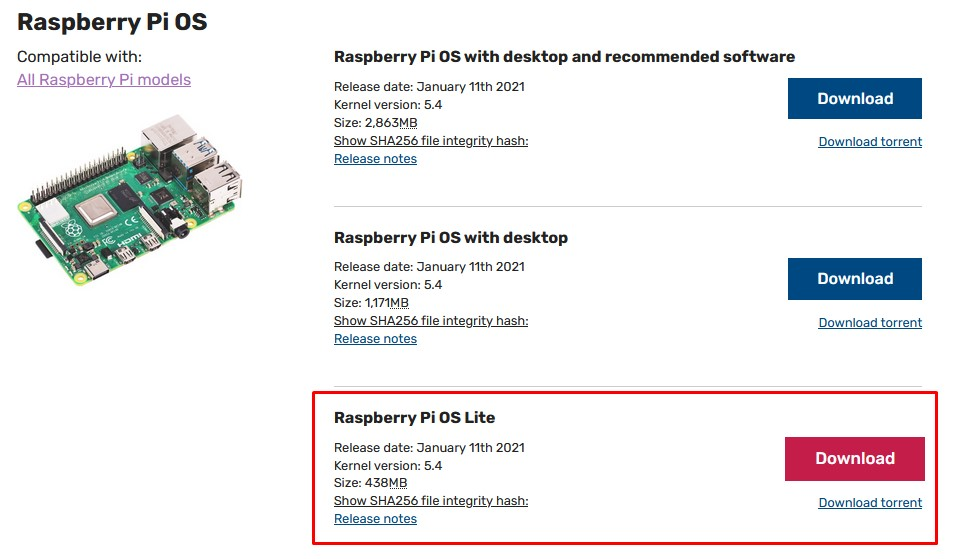
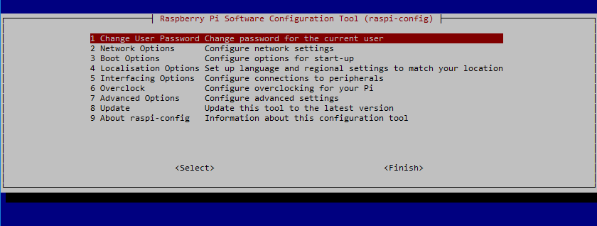
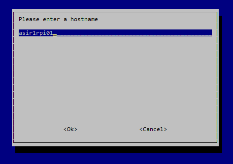
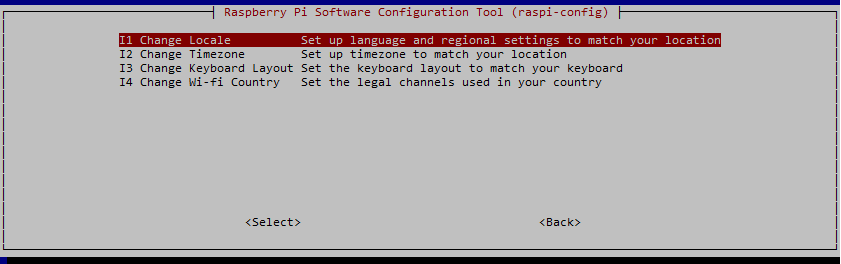
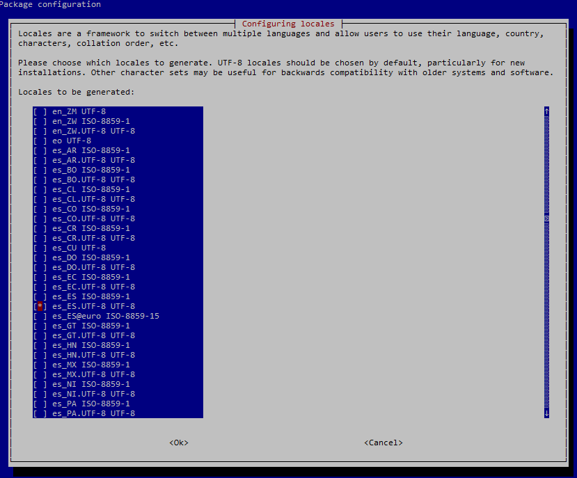
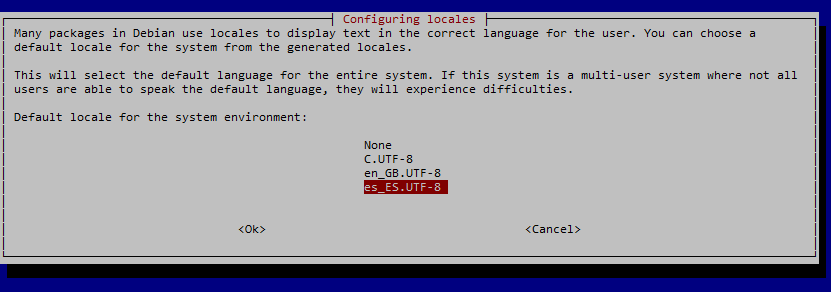
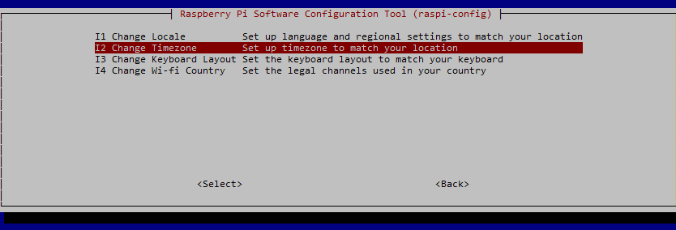
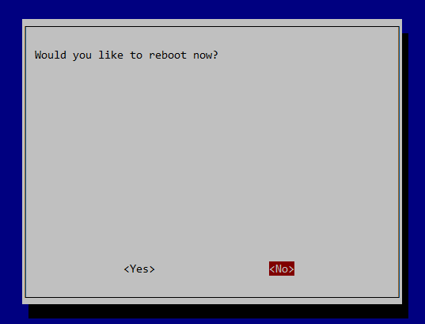

# Puesta en marcha de la Raspberry Pi (Desde Ubuntu)

## Raspberry Pi OS
El sistema operativo “oficial” de la Raspberry Pi es el Raspberry Pi OS, anteriormente denominado *Raspbian*. Es una adaptación de *Debian*, la popular distribución de Linux. Además de *Raspberry PI OS* (*Raspbian*) se pueden instalar otros sistemas operativos adaptados a la arquitectura ARM del procesador de la Raspberry, incluida una versión de Windows 10.

Para instalar estos sistemas operativos en la tarjeta SD (la tarjeta SD hará las funciones de disco duro de la RPi) podemos utilizar programas de grabación de imágenes tanto en Windows como en Linux.

Podemos optar por grabar la imagen del sistema operativo directamente o utilizar una imagen del instalador llamado *Noobs* el cual nos permitirá, mediante un entorno gráfico, indicarle cuál es el sistema operativo que deseamos instalar y el propio *Noobs* descargará la correspondiente imagen y la grabará en la tarjeta SD lista para ser utilizada en el siguiente arranque.

Nosotros vamos a optar por no utilizar *Noobs* y grabaremos directamente la imagen de Raspberry Pi OS en la tarjeta SD.

El proceso de grabación de la imagen se puede realizar tanto en Windows como en Linux. En esta documentación aparecen los pasos a seguir utilizando un sistema operativo Windows 10.

**En esta documentación se utilizará indistintamente la nomenclatura *Raspbian* o *Raspberry Pi OS* para hacer referencia al sistema operativo.**

### Descarga de Raspberry Pi OS
Accedemos a la página oficial de Raspberry Pi y en el apartado *Software* nos vamos a la opción de descargar *Raspberry Pi OS*.
(https://www.raspberrypi.org/software/operating-systems/#raspberry-pi-os-32-bit)

Nos da 3 ediciones posibles para descargar:
- Raspbian con entorno gráfico y programas recomendados ya instalados.
- Raspbian con entorno gráfico sin programas instalados.
- Raspbian Lite sin entorno gráfico.

Seleccionamos la edición Lite, la más ligera y que no incorpora herramientas gráficas.

Descargamos el fichero zip o hacemos la descarga por torrent. En el directorio *Descargas* nos quedará el fichero:
*2021-01-11-raspios-buster-armhf.lite.zip*

El nombre del fichero variará según la versión de Raspberry Pi OS que estemos descargando en ese momento. Nos aparecerá disponible para la descarga siempre la versión más reciente.

Abrimos un terminal y nos situamos en nuestro directorio *Descargas*:

    $ cd Descargas

Descomprimimos el fichero descargado:

    $ unzip 2021-01-11-raspios-buster-armhf-lite.zip

Comprobamos con un ls que está el fichero descargado y vemos que aún tenemos el fichero zip. Como el zip ya no nos hace falta, lo eliminamos:

    $ ls
    $ rm 2021-01-11-raspios-buster-armhf-lite.zip

## Preparación de la tarjeta SD
### Formateo de la tarjeta
Para poder instalar la imagen descargada en la tarjeta SD en Linux no es necesario utilizar ningún programa especial, con los comandos del sistema operativo es suficiente..

Para trabajar con la tarjeta la introduciremos en un lector de tarjetas o en un adaptador USB conectado al ordenador.

Una vez conectado el dispositivo, comprobamos el nombre que le ha dado, así como si nos ha montado automáticamente el sistema de ficheros que pudiera haber en la tarjeta, en cuyo caso habrá que desmontarlo.

Comprobamos con el mandato *lsblk*:

    $ lsblk
    
    NAME        MAJ:MIN RM   SIZE RO TYPE MOUNTPOINT
    sdb           8:0    1  14,5G  0 disk 
    ├─sdb1        8:1    1   256M  0 part /media/usuario/boot
    └─sdb2        8:2    1   1,5G  0 part /media/usuario/rootfs

Nos fijamos en el nombre que se le ha dado al dispositivo (/dev/sdb) y si hay algo en la columna MOUNTPOINT. Puesto que me aparecen 2 particiones (/dev/sdb1 y /dev/sdb2) y ambas están montadas (lo indica en MOUNTPOINT), procedemos a desmontarlas:

    $ sudo umount /dev/sdb1
    $ sudo umount /dev/sdb2

### Instalación del Sistema Operativo
Para grabar la imagen de Raspbian vamos a utilizar la utilidad *dd* de Linux. Este comando permite copiar datos a bajo nivel, permitiendo la copia de dispositivos y particiones como si de archivos se trataran.

Asumiendo que tenemos el fichero *.img* en el directorio *~/Descargas* y que estamos situados en él, procedemos a grabarlo en la tarjeta (recordemos el nombre de dispositivo que le había dado: /dev/sdb). Hay que indicar el fichero origen (if) el fichero destino (of) y le indicamos que lea y escriba de 4MB en 4MB (parámetro bs):

    $ sudo dd bs=4M if=2021-01-11-raspios-buster-armhf-lite.img of=/dev/sdb

Una vez ya se ha grabado la imagen en la tarjeta SD podemos comprobar que se han creado 2 particiones dentro de la tarjeta.

    $ lsblk

    NAME        MAJ:MIN RM   SIZE RO TYPE MOUNTPOINT
    sdb           8:0    1  14,5G  0 disk 
    ├─sdb1        8:1    1   256M  0 part 
    └─sdb2        8:2    1   1,5G  0 part 

La primera partición es la partición de arranque que está formateada en FAT32 y ocupa 256M. 

La segunda partición es la del sistema Raspbian, formateada con el sistema de ficheros EXT4. Sólo ocupa 1,5GB, el resto de la tarjeta está sin formatear, pero no es mayor problema, pues una vez arranque Raspbian por primera vez redimensionará automáticamente la partición del sistema ocupando todo el espacio disponible en la SD.

Si las particiones no están montadas automáticamente (no aparece nada en la columna MOUNTPOINT), procedemos a extraer la tarjeta del ordenador y la volvemos a conectar para que se monte automáticamente.

Si todo ha ido bien, volvemos a ejecutar *lsblk* y comprobamos los puntos de montaje.

    $ lsblk

    NAME        MAJ:MIN RM   SIZE RO TYPE MOUNTPOINT
    sda           8:0    1  14,5G  0 disk 
    ├─sdb1        8:1    1   256M  0 part /media/usuario/boot
    └─sdb2        8:2    1   1,5G  0 part /media/usuario/rootfs

Ahora podemos acceder a la tarjeta SD accediendo a esos 2 directorios de punto de montaje.

## Modificación de los archivos de configuración de la red
### Configuración de las opciones de arranque
Vamos a utilizar nuestra Raspberry en modo servidor, es decir, sin conectarla a un monitor. La versión de Raspberry Pi OS que hemos descargado no lleva entorno gráfico, por tanto todas las órdenes que le demos serán por comandos. La única forma que tendremos de interactuar con ella será mediante una consola de comandos.

Esto nos va a resultar muy cómodo, pues simplemente estableciendo una conexión remota de terminal (mediante SSH) nos permitirá trabajar en la RPi, y nos ahorramos el tener que conectar un monitor, un teclado y un ratón.

El único inconveniente es que para poder conectarnos remotamente necesitamos tener instalado el servicio SSH (no viene por defecto instalado como medida de seguridad) y saber la dirección IP que tenemos asignada (en caso de que sea automática) o bien configurada (en caso de que sea manual o no tengamos servidor DHCP).

Afortunadamente podemos configurar el sistema antes del primer arranque de modo que se instale el servidor SSH y se le conceda una IP estática que nosotros elijamos. Para ello, antes de extraer del ordenador la tarjeta SD, nos situamos en el directorio donde está montada la partición de arranque:

    $ cd /media/usuario/boot

Para que se active el servidor SSH en el primer arranque basta con crear un fichero vacío llamado *ssh* en esa unidad.

    $ touch ssh

Dependiendo de cómo queremos conectar la Raspberry Pi a la red hemos de sguir una serie de pasos que se detallan a continuación:
- **Conexión por WiFi con IP dinámica**.
- **Conexión por cable de red con IP dinámica**.
- **Conexión por cable de red con IP fija**.

Por tanto de los 3 puntos que se detallan a continuación sólo hemos de seguir uno.

### Configuración WiFi y asignación de IP por DHCP
Si deseamos conectarnos vía WiFi a nuestra red, en lugar de con una conexión cableada, deberemos configurar la conexión creando en el mismo directorio en el que creamos el fichero ssh, un nuevo fichero llamado **wpa_supplicant.conf**. Estando en el directorio */media/usuario/boot* utilizamos el editor de textos *nano*:

    $ nano wpa_supplicant.conf

Y tecleamos el siguiente contenido:

    # /etc/wpa_supplicant/wpa_supplicant.conf
    ctrl_interface=DIR=/var/run/wpa_supplicant GROUP=netdev 
    update_config=1
    country=ES
    network={
        ssid="nombre de tu router o SSID"
        psk="tu contraseña del wi-fi"
        key_mgmt=WPA-PSK 
    }

Para salir del editor nano pulsamos *Ctrl+X* para salir y cuando nos pregunta si queremos guardar pulsamos la tecla *y* (*s*).

Puesto que no sabemos la dirección IP que le va a asignar y puesto que en el aula habrá más Raspberrys que tendrán el mismo nombre de equipo (*raspberry*), vamos a cambiar el nombre de modo que podamos saber a qué Raspberry estamos conectados.

Nos situamos en el directorio donde se ha montado la otra partición (/dev/sdb2).

    $ cd /media/usuario/rootfs

Nos metemos en el directorio etc, que es donde se guardan los ficheros de configuración de Linux. En este caso del sistema operativo de la Raspberry Pi:

    $ cd etc

Modificamos el fichero *hostname* que contiene el nombre del host, es decir, de nuestra Raspberry Pi. Para poder modificarlo necesitamos privilegios de administrador, por lo tanto utilizamos el mandato *sudo*:

    $ sudo nano hostname

Sustituimos el nombre por defecto de la máquina y ponemos uno único (por ejemplo asir1rpi01). Salimos del editor con CTRL+X guardando.

Hacemos lo mismo en el fichero hosts, sustituyendo el nombre antiguo (raspberry) por el que deseemos:

    $ sudo nano hosts

Salimos del editor con CTRL+X guardando.

Nos situamos en nuestra carpeta personal, como paso previo para poder desmontar los dispositivos:

    $ cd

Desmontamos el sistema de ficheros:

    $ sudo umount /dev/sdb1
    $ sudo umount /dev/sdb2

Extraemos la tarjeta SD del ordenador.

Con esto sería suficiente para poder establecer una conexión remota. Si disponemos de un servidor DHCP, éste le asignará una dirección IP automática a la Raspberry Pi. Para saber qué dirección IP le ha asignado y por tanto saber a qué dirección nos tenemos que conectar, deberemos utilizar un programa que escanee todas las direcciones IP de la red o accedemos al router y vemos qué IP le ha asignado automáticamente.

Programas hay muchos para escanear la red, tanto para PC, Linux o Mac, incluso en Android, siendo muy cómo hacerlo desde el móvil si estamos conectadoa una red WiFi. Nosotros lo haremos con el programa *nmap*, lo veremos más adelante.

### Conexión a la red por cable con IP dinámica
Si conectamos nuestra Raspberry Pi por cable y disponemos de un servidor DHCP no es necesario tocar ningún fichero de configuración. Basta con conectar el cable de red, y una vez arrancada la Raspberry buscar con algún programa de escaneo de IPs, qué dirección IP le ha asignado el servidor DHCP.

### Configuración IP fija en red cableada sin DHCP
Si optáramos por una red cableada y quisiéramos asignar una IP manual de manera provisional podríamos hacerlo del siguiente modo.

Estando en el directorio */media/usuario/boot* utilizamos el editor de textos *nano*:

    $ nano cmdline.txt

Añadimos al inicio de la línea (y añadiendo un espacio en blanco después):

    ip=192.168.1.99

Sustituyendo la dirección IP por la que deseemos. Salimos del editor con CTRL+X guardando.

Nos situamos en nuestra carpeta personal, como paso previo para poder desmontar los dispositivos:

    $ cd

Desmontamos el sistema de ficheros:

    $ sudo umount /dev/sdb1
    $ sudo umount /dev/sdb2

Extraemos la tarjeta SD del ordenador.

Una vez tuviéramos en marcha la Raspberry Pi, deberíamos asignar la dirección IP estática mediante las opciones de configuración. Ver más adelante.

## Puesta en marcha
Una vez flasheada la tarjeta SD y creados y modificados los ficheros necesarios, la extraemos del ordenador, la introducimos en la Raspberry Pi y conectamos la fuente de alimentación y el cable de red (si no hubiéramos configurado la conexión WiFi).

Al enchufar la fuente de alimentación se enciende la automáticamente la Raspberry, arrancando el sistema operativo que hemos grabado en la tarjeta SD.

Si hubiéramos conectado un monitor por el puerto HDMI, así como un teclado y un ratón por los puertos USB, tendríamos un terminal listo para ser utilizado, pero vamos a prescindir de monitor, teclado y ratón y la conexión la haremos vía terminal remoto.

Si la configuración que hemos grabado ha sido correcta, al arrancar la Raspberry se ha debido activar el servicio SSH y se ha debido configurar la red con la dirección IP estática que le hemos asignado o la conexión WiFi que hemos configurado. Estamos por tanto en condiciones de conectarnos de manera remota desde un terminal SSH.

### Conexión por SSH
Con la Raspberry Pi funcionando y el servicio SSH arrancado, el siguiente paso será abrir una sesión remota desde nuestro ordenador.

Para conectarnos vía SSH necesitamos tener instalado en nuestro equipo un cliente SSH. Uno de los más populares es el programa PuTTY, que nos podemos descargar gratuitamente, pues es software libre (https://www.putty.org/). PuTTY nos permite conectarnos vía ssh, pero también utilizando otros protocolos.

Nosotros vamos a utilizar el cliente ssh que viene instalado en Linux. Para ello basta con abrir un terminal y ejecutar el mandato ssh.

Lo primero que debemos hacer es averiguar la IP de nuestra Raspberry Pi (si no le hemos indicado IP estática). Podemos utilizar cualquier programa de escaneo de la red. Desde la línea de comandos podemos ejecutar el nmap. En primer lugar lo instalamos:

    $ sudo apt-get update
    $ sudo apt-get install nmap -y

Una vez instalado vamos a escanear aquellas máquinas que tienen el puero 22 (ssh) abierto de nuestra red:

    $ nmap -p 22 --open 192.168.1.0/24

Una de las que salgan será nuestra Raspberry Pi. Procedemos a conectarnos una vez identificada.

Podemos ejecutar el ssh indicándole simplemente la dirección IP del servidor (en este caso nuestra Raspberry), pero intentaría conectarse con el nombre del usuario con el que estamos conectados. Para conectarnos con un usuario distinto debemos indicárselo en el mandato de conexión anteponiéndolo a la dirección ip:

    ssh usuario@dirección_ip

Por defecto, Raspbian ha creado un usuario llamado pi cuya contraseña es raspberry:
- Usuario: **pi**
- Contraseña: **raspberry**

Nos conectamos utilizando estas credenciales a la dirección que se le ha asignado a la Raspberry Pi. Ejecutamos el comando ssh:

    $ ssh pi@192.168.1.99

Nos pide que confirmemos la conexión a pesar de no tener un certificado de confianza del lugar al que nos conectamos. Contestamos **yes**

    The authenticity of host '192.168.1.99 (192.168.1.99)' can't be established.
    ECDSA key fingerprint is SHA256:N2/8mPHeuypQ4f8QgBWbeCEMaqyQxse/BzzvAE8uilc.
    Are you sure you want to continue connecting (yes/no)? yes

A continuación nos pide la contraseña. En nuestro caso **raspberry**

    Warning: Permanently added '192.168.1.99' (ECDSA) to the list of known hosts.
    pi@192.168.1.99's password:

Y ya estamos dentro del sistema:

    Linux raspberrypi 4.19.75-v7l+ #1270 SMP Tue Sep 24 18:51:41 BST 2019 armv7l

    The programs included with the Debian GNU/Linux system are free software;
    the exact distribution terms for each program are described in the
    individual files in /usr/share/doc/*/copyright.

    Debian GNU/Linux comes with ABSOLUTELY NO WARRANTY, to the extent
    permitted by applicable law.

    SSH is enabled and the default password for the 'pi' user has not been changed.
    This is a security risk - please login as the 'pi' user and type 'passwd' to set a new password.

Nos avisa de que el SSH está activado y la contraseña del usuario pi es la que viene por defecto, suponiendo un grave riesgo de seguridad el tener la conexión expuesta de esa forma.

Ya podemos empezar a disfrutar de nuestra Raspberry Pi.

## Configuración de la Raspberry Pi
Como nos advertía Raspbian nada más entrar, la contraseña de nuestro usuario es conocida por todo el mundo, así que lo primero que vamos a hacer es cambiarla. Para ello tecleamos el mandato *passwd*:

    pi@raspberrypi:~ $ passwd

E introducimos la contraseña antigua y dos veces la nueva:

    Changing password for pi.
    Current password: *********
    New password: ********
    Retype new password: *********
    passwd: password updated successfully

Esto mismo lo podríamos haber hecho con la utilidad que incluye Raspbian para configurar la RPi. Esta utilidad se llama *raspi-config* y puesto que necesitamos privilegios de administrador para ejecutarla, la invocamos anteponiendo el *sudo*:

    pi@raspberrypi:~ $ sudo raspi-config

Nos aparece un menú como el siguiente:

Desde la primera opción podemos cambiar la contraseña del usuario tal y como hemos hecho desde la línea de comandos.

A continuación entramos en **Network Options** y cambiamos el nombre de la máquina (**Hostname**). Por ejemplo *asir1rpi01*

Después entramos en la opción **Localisation Options** para cambiar la configuración del idioma y la zona horaria:

En primer lugar cambiamos la configuración regional del idioma, pulsamos sobre **Change Locale**. En el menú que nos aparece, avanzamos página con las teclas hasta selecciona la opción del idioma español de España con UTF-8. Cuando estemos sobre él pulsamos la barra espaciadora para seleccionarlo:

Con el tabulador nos movemos hasta el OK y pulsamos Intro.

En la siguiente pantalla lo seleccionamos como idioma por defecto:

Después de instalarse el paquete de idiomas, volvemos a entrar en la opción **Localisation Options** para cambiar la zona horaria:

Seleccionamos Europa-->Madrid.

El teclado no hará falta cambiarlo, pero es posible que si hubiéramos arrancado desde un terminal con un teclado conectado al USB nos tocara configurarlo si no lo hubiera hecho de manera automática.

Salimos del programa de configuración con la opción Finish y nos pide reiniciar la RPi. Seleccionamos NO. La reiniciaremos después:

 
**IMPORTANTE:** Si habíamos configurado el primer arranque con una IP estática, debemos configurar correctamente el adaptador de red y eliminar la dirección IP que le habíamos pasado al programa de inicio mediante el fichero *cmdline.txt*. Para ello vamos a editar ese fichero con el editor de textos **nano*. El fichero se encuentra en el directorio */boot* y para poder escribir en él necesitamos tener privilegios de administrador, por tanto ejecutaremos el mandato con el *sudo* delante.

    pi@raspberrypi:~ $ sudo nano /boot/cmdline.txt

Una vez dentro del editor, modificamos la línea y eliminamos la dirección ip que habíamos añadido para dejar el fichero como estaba originariamente.

Para salir del editor nano pulsamos *Ctrl+X* para salir y cuando nos pregunta si queremos guardar pulsamos la tecla *y* (*s*).

Por último, vamos a editar el fichero donde se almacena la configuración de la red para dejar como dirección IP estática la que habíamos asignado provisionalmente. Este fichero es el *dhcpcd.conf* que se encuentra en el directorio */etc*

Editamos el fichero:

    pi@raspberrypi:~ $ sudo nano /etc/dhcpcd.conf

Avanzamos página hasta encontrarnos con las siguientes líneas en el fichero:

    # Example static IP configuration:
    #interface eth0
    #static ip_address=192.168.0.10/24
    #static ip6_address=fd51:42f8:caae:d92e::ff/64
    #static routers=192.168.0.1
    #static domain_name_servers=192.168.0.1 8.8.8.8 fd51:42f8:caae:d92e::1

Quitamos la almohadilla (#) de las líneas que vamos a modificar y sustituimos la IP por la que queremos y la dirección del router por nuestra puerta de enlace:

    # Example static IP configuration:
    interface eth0
    static ip_address=192.168.1.99/24
    #static ip6_address=fd51:42f8:caae:d92e::ff/64
    static routers=192.168.1.1
    #static domain_name_servers=192.168.0.1 8.8.8.8 fd51:42f8:caae:d92e::1

Ahora, ya sí, procedemos a reiniciar la RPi para que tengan efecto todos los cambios.

    pi@raspberrypi:~ $ sudo reboot

## Generación de un par de claves SSH
Ya hemos visto cómo conectarnos remotamente a un equipo (en este caso a nuestra RPi) mediante el protocolo SSH. Vamos a dar un nivel más de seguridad a la conexión haciendo que la conexión al equipo sea mediante una autenticación de clave pública (en lugar de usuario y contraseña).

La autenticación con clave pública para conectarse a un servidor remoto usando el protocolo SSH funciona con dos claves: una pública y otra privada. Para entender el funcionamiento se suele recurrir a la metáfora del candado y la llave. La clave pública funciona como un candado y la privada como la llave. El candado se colocará en el servidor remoto al que se quiere acceder (en este caso en la Raspberry Pi); cuando se intenta acceder se comprobará que la máquina que intenta conectar (nuestro PC) tiene la llave, la clave privada.

Para configurar el acceso SSH con clave pública hay que hacer los siguientes pasos:
- Generar el par de claves pública/privada.
- Copiar la clave pública al servidor (la Raspberry).
- Deshabilitar el acceso al servidor con contraseña.

Al tratarse el nuestro de un entorno de pruebas, el último paso de **deshabilitar el acceso mediante contraseña no lo vamos a hacer**, así evitaremos problemas y podremos conectarnos desde cualquier equipo y con cualquier usuario poniendo la contraseña.

### Generación de las claves
En primer lugar, para generar las claves podemos usar **ssh-keygen** en la máquina local desde la que nos queremos conectar al servidor.

Si estamos conectados a la Raspberry Pi, en primer lugar vamos a salir tecleando *exit*. Con este comando cerramos sesión pero no apagamos la Raspberry.

    pi@asir1rpi01:~ $ exit

Ahora ya, en nuestra máquina Linux (y sin tener ninguna conexión SSH abierta) tecleamos:

    $ ssh-keygen -t rsa -b 4096

ssh-keygen pide la ruta y el nombre del archivo que alojará las claves pública y privada. La clave privada se puede proteger a su vez con una contraseña. De esta manera, si cae en manos no deseadas, lo tendrá un poco más difícil para usarla.

    Generating public/private rsa key pair.
    Enter file in which to save the key (C:\Users\Usuario/.ssh/id_rsa):
    Enter passphrase (empty for no passphrase):
    Enter same passphrase again:
    Your identification has been saved in C:\Users\Usuario/.ssh/id_rsa.
    Your public key has been saved in C:\Users\Usuario/.ssh/id_rsa.pub.
    The key fingerprint is:
    SHA256:jR7xnkMP3xQLjK3Y644hSRN8UYRCcnMtyAZkxh85ggI usuario@equipo
    The key's randomart image is:
    +---[RSA 4096]----+
    |E  +*++oo=o      |
    |. .oo+Ooo..+     |
    | .   +o+o.. + .  |
    |      .o B . . o |
    |      o S B . o  |
    |     o + + * o   |
    |      o o = o .  |
    |       . + .     |
    |        ..o      |
    +----[SHA256]-----+

ssh-keygen generará dos archivos:
- **id_rsa** es la clave privada, la que permanecerá en la máquina local.
- **id_rsa.pub** es la clave pública, la que se tiene que copiar al servidor remoto al que se quiere acceder (el candado que decíamos en la RPi).

Ambos ficheros los crea (si no le indicamos lo contrario) en una carpeta llamada *.ssh* dentro de nuestra carpeta personal.

### Copia de la clave pública en la Raspberry Pi
Una vez generado el par de claves en la máquina local hay que copiar la clave pública al servidor remoto, es decir, a nuestra Raspberry Pi.

Copiamos directamente el archivo de clave pública desde el cliente al servidor con el comando *scp* (ssh copy):

    $ scp ~/.ssh/id_rsa.pub pi@192.168.1.99:/home/pi/uploaded_key.pub

Una vez copiado, iniciamos de nuevo sesión en la Raspberry:

    $ ssh pi@192.168.1.99

La clave pública hay que incluirla en el archivo **authorized_keys** dentro de un directorio llamado *.ssh* de la carpeta personal del usuario pi (*/home/pi/.ssh/authorized_keys*). Como la carpeta *.*ssh* no existe, la creamos antes de copiar, así como el archivo *authorized_keys*:

    pi@asir1rpi01:~ $ mkdir .ssh
    pi@asir1rpi01:~ $ chmod 700 .ssh
    pi@asir1rpi01:~ $ touch .ssh/authorized_keys
    pi@asir1rpi01:~ $ chmod 644 .ssh/authorized_keys

Una ve creados los ficheros necesarios copiamos el contenido del fichero que acabamos de subir al fichero */home/pi/.ssh/authorized_keys* que acabamos de crear:

    pi@asir1rpi01:~ $ cat /home/pi/uploaded_key.pub >> /home/pi/.ssh/authorized_keys

A partir de este momento, si cerramos la sesión ssh, cada vez que nos conectemos desde ese mismo equipo y con ese mismo usuario a nuestra raspberry, ya no nos pedirá la contraseña.

### Deshabilitación del acceso por contraseña
Una vez habilitado el acceso SSH mediante clave pública, se puede deshabilitar el acceso con contraseña. Esto aumentará la seguridad, pero implica que si se pierde la clave privada se perderá el acceso al servidor: hay que guardar cuidadosamente la clave privada.

Para deshabilitar el acceso por contraseña hay que seguir los siguientes pasos. **Nosotros no los vamos a ejecutar**.

La configuración del servidor SSH se puede encontrar en el archivo */etc/ssh/sshd_config*. Para deshabilitar el acceso SSH con contraseña hay editar el archivo con *sudo*:

    pi@asir1pi01:~ $ sudo nano /etc/ssh/sshd_config

Y añadimos la siguiente línea:

    PasswordAuthentication no

Para aumentar la seguridad se pueden hacer dos ajustes adicionales en el archivo */etc/ssh/sshd_config*.
Desactivar el acceso ssh para el usuario *root*:

    PermitRootLogin no

Dar acceso SSH solo a los usuarios que lo necesiten, y no a todos:

    AllowUsers usuario1 usuario2

Una vez realizados los cambios, hay que reiniciar el servidor SSH, siempre como *root*:

    pi@raspberrypi:~ $ sudo service sshd restart
	

## Desconexión y apagado de la Raspberry Pi
Por último, cada vez que deseemos cerrar una sesión de terminal (bien sea mediante SSH o desde una consola) sin apagar la Raspberry Pi, debemos teclear el mandato *exit*:

    pi@raspberrypi:~ $ exit

Si lo que deseamos es reiniciar el sistema, teclearemos la orden *reboot* (con privilegios de administrador):

    pi@raspberrypi:~ $ sudo reboot

Para apagar el sistema podemos ejecutar *poweroff* o *shutdown*. Nosotros vamos a ejecutar el mandato *shutdown* con las opciones *-h* para que pare (halt) y *now* para que no espere un tiempo para apagar:

    pi@raspberrypi:~ $ sudo shutdown -h now

**OJO**. Una vez ejecutemos el shutdown se cerrará la conexión ssh pero el sistema continuará el proceso de apagado y no sabremos en qué situación se encuentra. Deberemos esperar unos minutos hasta que el sistema esté completamente apagado antes de retirar el cable de alimentación.
