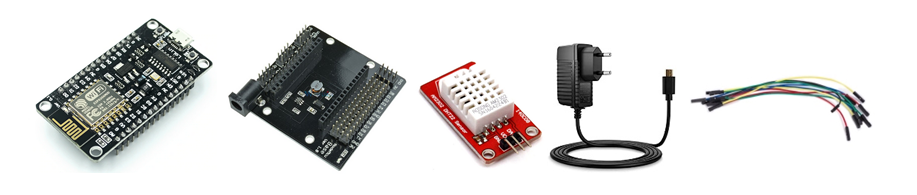

# Elementos necesarios

En este proyecto tenemos por un lado el dispositivo IoT que se encargará de medir y enviar vía WiFi los datos de temperatura y humedad; y por otro lado el servidor que se encargará de recibir esos datos, procesarlos, almacenarlos y servirlos vía web.

Para el dispositivo IoT utilizaremos una placa de desarrollo NodeMCU basada en el microcontrlador ESP8266 con tarjeta WiFi. A esa placa de desarrollo conectaremos un sensor de temperatura y humedad DHT22.

Para el servidor utilizaremos una Raspberry Pi con Raspbian instalado y configurado.

Dispositivo cliente:
- Placa NodeMCU v3 con ESP8266
- NodeMCU Breadboard (opcional). Placa para facilitar la conexión entre el NodeMCU y los componentes.
- Sensor DHT22. Sensor de temperatura y humedad.
- Alimentador MicroUSB.
- 3 Cables puente para conectar el sensor DHT22 al NodeMCU

Servidor:
- Raspberry Pi 4 model B.
- Tarjeta SD.
- Alimentador MicroUSB.

La placa NodeMCU es una placa de desarrollo totalmente abierta, a nivel de software y de hardware. Al igual que ocurre con Arduino, en NodeMCU todo está dispuesto para facilitar la programación de un microcontrolador o MCU (del inglés Microcontroller Unit).

No hay que confundir microcontrolador con placa de desarrollo. NodeMCU no es un microcontrolador al igual que Arduino tampoco lo es. Son placas o kits de desarrollo que llevan incorporados un microcontrolador o MCU, en el caso de NodeMCU lleva el MCU ESP8266. Lo atractivo de NodeMCU con respecto a Arduino UNO es que incorpora un módulo WiFi.

