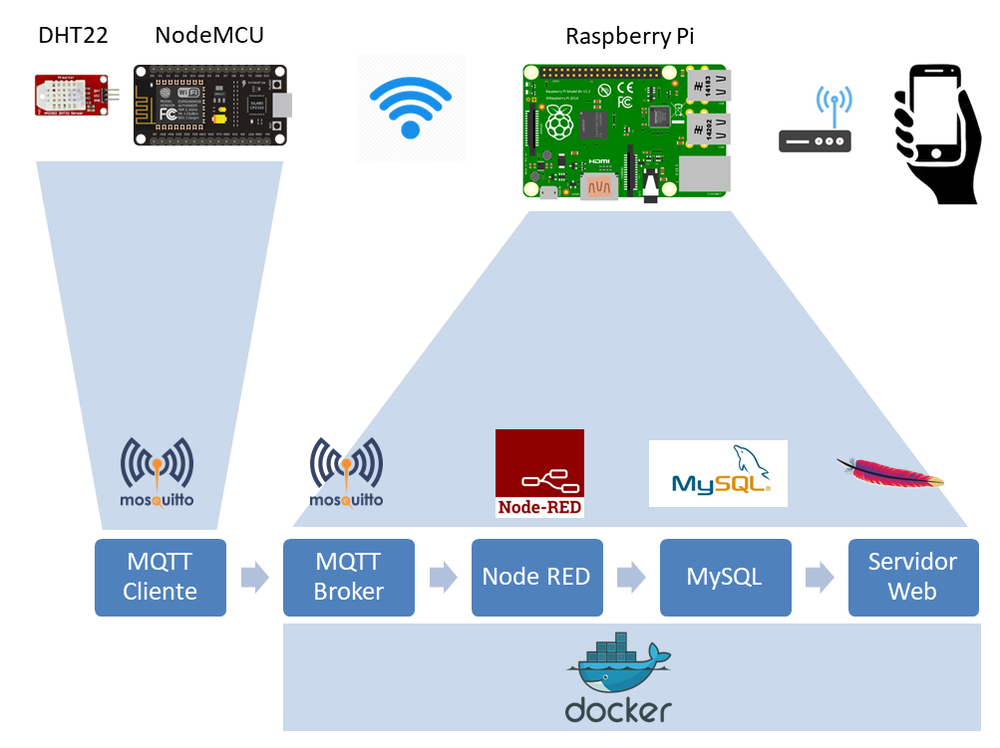

# Objetivo del proyecto IoT

Este proyecto consiste en la creación de una estación meteorológica conectada a la red con la posibilidad de acceder a sus datos remotamente vía web. Para ello, implementaremos un pequeño sistema IoT doméstico con sensores de temperatura y humedad conectados a nuestra wifi que almacenará las lecturas obtenidas en una base de datos ubicada en una Raspberry Pi, que a su vez también actuará de servidor web.

El paso de los datos desde el sensor hasta la Raspberry Pi se hará mediante el protocolo MQTT. Los mensajes MQTT recibidos vía WiFi en la Raspberry se procesarán mediante Node-RED y se almacenarán en una BBDD en MySQL, estando disponibles para ser accedidos por el servidor web Apache también ubicado en la Raspberry Pi.

Para hacer más interesante el proyecto y aislar los distintos servicios alojados en la Raspberry Pi, todos los servicios serán contenerizados con Docker.

