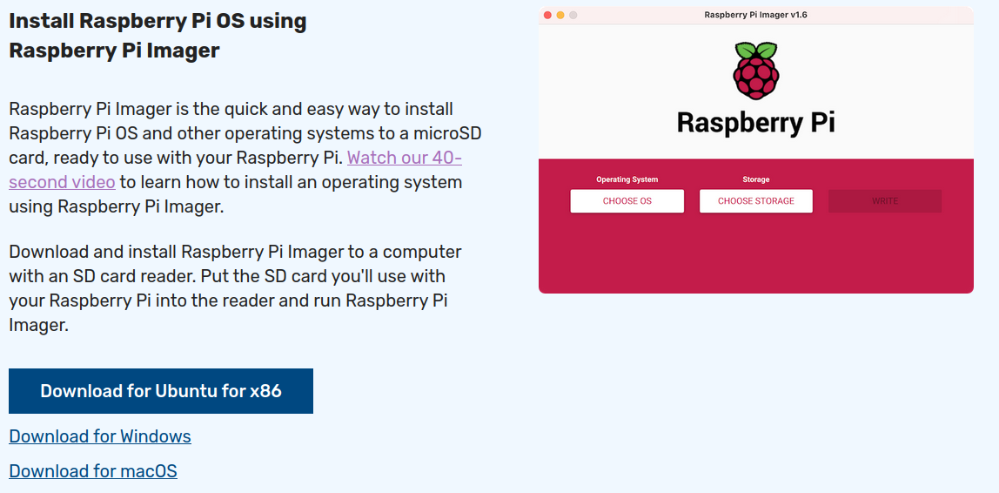
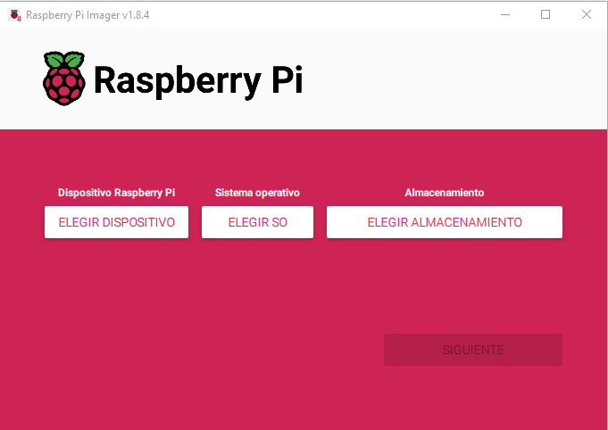
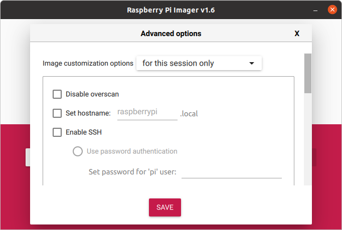
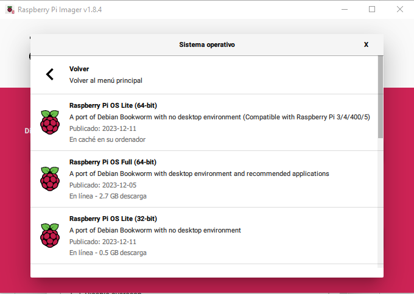

# Puesta en marcha rápida de la Raspberry Pi

## Raspberry Pi OS
El sistema operativo “oficial” de la Raspberry Pi es el Raspberry Pi OS, anteriormente denominado *Raspbian*. Es una adaptación de *Debian*, la popular distribución de Linux. Además de *Raspberry PI OS* (*Raspbian*) se pueden instalar otros sistemas operativos adaptados a la arquitectura ARM del procesador de la Raspberry, incluida una versión de Windows 10.

Para instalar estos sistemas operativos en la tarjeta SD (la tarjeta SD hará las funciones de disco duro de la RPi) podemos utilizar programas de grabación de imágenes tanto en Windows como en Linux. Se explica en los apartados  y 

Este apartado explica cómo utilizar el instalador **Raspberry Pi Imager** para flasear la tarjeta SD con el sistema operativo, la configuración de red, nombre de la máquina y contraseña del usuario Pi, de una manera rápida y sencilla.

El programa de grabación de la imagen está disponible tanto para Windows como Linux.

**En esta documentación se utilizará indistintamente la nomenclatura *Raspbian* o *Raspberry Pi OS* para hacer referencia al sistema operativo.**

## Descarga de Raspberry Pi Imager
Desde nuestro equipo con Windows o Linux accedemos comn un navegador a la página oficial de Raspberry Pi y en el apartado *Software* nos vamos a la opción de descargar *Raspberry Pi Imager*.

Seleccionamos la edición apropiada para nuestro sistema operativo e instalamos el programa una vez descargado.

Si el instalador de Ubuntu no se nos lanza automáticamente, podemos descargar el archivo y desde un terminal instalar el paquete descargado.

    $ sudo dpkg -i ~/Descargas/imager_1.6_amd64.deb 

## Grabación de la imagen
Una vez instalado el programa de *Raspberry Pi Imager*, procedemos a la grbación de la imagen en la tarjeta SD.

Introducimos la tarjeta SD en el ordenador.

Ejecutamos el programa *Raspberry Pi Imager*.

Una vez está en ejecución el programa, pulsamos la combinación mágica de teclas **Ctrl+May+X**.

Rellenamos con las opciones de Configuración:
- Ponemos el nombre de Hostname
- Habilitamos el SSH
- Ponemos la contraseña nueva para el ususario *Pi*
- Configuramos la WiFi en caso de que nos vayamos a conectar por WiFi (Importante seleccionar el país de la Red WiFi)
- Establecemos el idioma del teclado y la zona horaria

Una vez guardadas las opciones de configuración, debemos elegir el sistema operativo a instalar. En este caso podemos optar por:
- Seleccionar el sistema operativo y que el Instaler lo descargue automáticamente de Internet.
- Descargar nosotros previamente el SO e indicarle en que carpeta se encuentra nuestro fichero *.img*

Si optamos por descargarlo en ese momento, debemos asegurarnos de seleccionar el Raspbian versión Lite. Para ello pulsamos sobre **Raspberry Pi OS (Other)** y después **Raspberry Pi OS Lite (32 bits)**.

Sólo nos queda seleccionar la unidad de la Tarjeta SD y darle a **Write**
