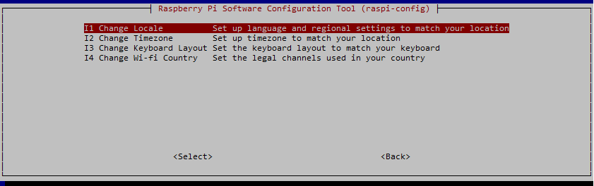
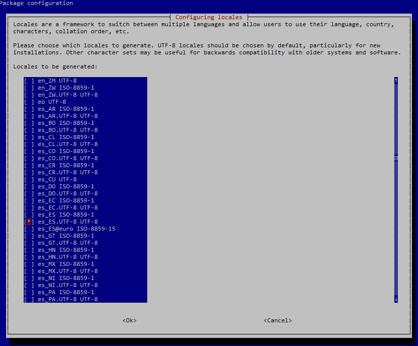
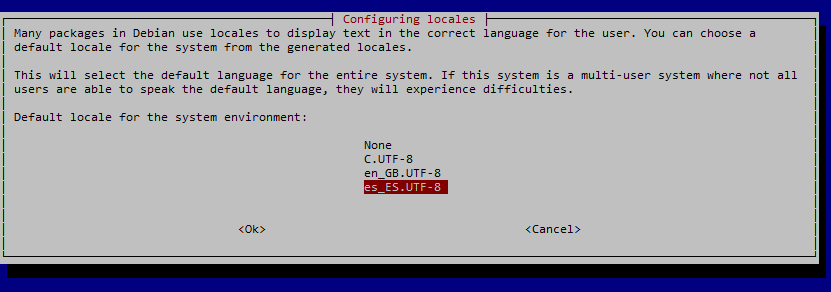
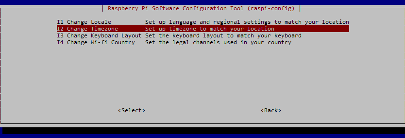
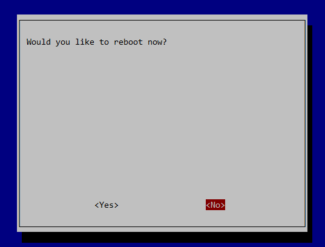

# Puesta en marcha rápida de la Raspberry Pi
{: .no_toc }

  

    Tabla de contenidos
  

  {: .text-delta }
- TOC
{:toc}

## Raspberry Pi OS
El sistema operativo “oficial” de la Raspberry Pi es el Raspberry Pi OS, anteriormente denominado *Raspbian*. Es una adaptación de *Debian*, la popular distribución de Linux. Además de *Raspberry PI OS* (*Raspbian*) se pueden instalar otros sistemas operativos adaptados a la arquitectura ARM del procesador de la Raspberry, incluida una versión de Windows 10.

Para instalar estos sistemas operativos en la tarjeta SD (la tarjeta SD hará las funciones de disco duro de la RPi) podemos utilizar programas de grabación de imágenes tanto en Windows como en Linux. Se explica en los apartados  y 

Este apartado explica cómo utilizar el instalador **Raspberry Pi Imager** para flasear la tarjeta SD con el sistema operativo, la configuración de red, nombre de la máquina y contraseña del usuario Pi, de una manera rápida y sencilla.

El programa de grabación de la imagen está disponible tanto para Windows como Linux.

{: .note }
En esta documentación se utilizará indistintamente la nomenclatura *Raspbian* o *Raspberry Pi OS* para hacer referencia al sistema operativo.

## Descarga de Raspberry Pi Imager
Desde nuestro equipo con Windows o Linux accedemos comn un navegador a la página oficial de Raspberry Pi y en el apartado *Software* nos vamos a la opción de descargar *Raspberry Pi Imager*.

Seleccionamos la edición apropiada para nuestro sistema operativo e instalamos el programa una vez descargado.

Si el instalador de Ubuntu no se nos lanza automáticamente, podemos descargar el archivo y desde un terminal instalar el paquete descargado.

    $ sudo dpkg -i ~/Descargas/imager_1.6_amd64.deb 

## Grabación de la imagen
Una vez instalado el programa de *Raspberry Pi Imager*, procedemos a la grabación de la imagen en la tarjeta SD.

Introducimos la tarjeta SD en el ordenador.

Ejecutamos el programa *Raspberry Pi Imager*.

En la primera pantalla debemos indicar el modelo del dispositivo Raspberry Pi con el que vamos a trabajar, elegir el sistema operativo a instalar y la unidad donde está la tarjeta SD. 

Para elegir el sistema operativo podemos optar por:
- Seleccionar el sistema operativo de la lista que nos propone y que el *Imager* lo descargue automáticamente de Internet.
- Descargar nosotros previamente el SO e indicarle en qué carpeta se encuentra nuestro fichero *.img*

Si optamos por descargarlo en ese momento, debemos asegurarnos de seleccionar el Raspbian versión Lite, es decir, la que no lleva interfaz gráfica puesto que no la vamos a utilizar. Para ello pulsamos sobre **Raspberry Pi OS (Other)** y después **Raspberry Pi OS Lite (64 bits)**.

Pulsamos *siguiente* y procedemos a ajustar los parámetros de personalización, que no hará más sencilla la post-instalación del sistema. Para ello pulsamos sobre *Editar Ajustes*.

Rellenamos con las opciones de Configuración:
- Ponemos el nombre de Hostname (cada uno que ponga su nombre o apellido)
- Ponemos un pmbre de usuario y una contraseña nueva para ese ususario. Si no la especificamos por defecto será *pi* y contraseña *raspberry*
- Configuramos la WiFi en caso de que nos vayamos a conectar por WiFi (Importante seleccionar el país de la Red WiFi)
- Establecemos el idioma del teclado y la zona horaria
- **Importante:** En la pestaña *Servicios* habilitamos el acceso por SSH

Una vez guardadas las opciones de configuración, sólo nos queda acptar los ajustes para que empiece a escribir el Sistema Operativo en la tarjeta SD.

## Puesta en marcha
Una vez flasheada la tarjeta SD y creados y modificados los ficheros necesarios, la extraemos del ordenador, la introducimos en la Raspberry Pi y conectamos la fuente de alimentación y el cable de red (si no hubiéramos configurado la conexión WiFi).

Al enchufar la fuente de alimentación se enciende la automáticamente la Raspberry, arrancando el sistema operativo que hemos grabado en la tarjeta SD.

Si hubiéramos conectado un monitor por el puerto HDMI, así como un teclado y un ratón por los puertos USB, tendríamos un terminal listo para ser utilizado, pero vamos a prescindir de monitor, teclado y ratón y la conexión la haremos vía terminal remoto.

{: .highlight }
Si la configuración que hemos grabado ha sido correcta, al arrancar la Raspberry se ha debido activar el servicio SSH y se ha debido configurar la red o la conexión WiFi que hemos configurado, pero no sabemos la IP. El primer paso será averiguar nuestra IP mediante alguna herramienta de escaneo de la red o accediendo al router y ver qué dirección se le ha asignado. Una vez averiguada esa IP ya estaremos en condiciones de conectarnos de manera remota desde un terminal SSH.

### Conexión por SSH
Con la Raspberry Pi funcionando y el servicio SSH arrancado, el siguiente paso será abrir una sesión remota desde nuestro ordenador.

Para conectarnos vía SSH necesitamos tener instalado en nuestro equipo un cliente SSH. Uno de los más populares es el programa PuTTY, que nos podemos descargar gratuitamente, pues es software libre (https://www.putty.org/). PuTTY nos permite conectarnos vía ssh, pero también utilizando otros protocolos.

Nosotros vamos a utilizar el cliente ssh que viene instalado tanto en Linux como en Windows. Para ello basta con abrir un terminal y ejecutar el mandato *ssh*.

Lo primero que debemos hacer es averiguar la IP de nuestra Raspberry Pi (si no le hemos indicado IP estática). Podemos utilizar cualquier programa de escaneo de la red. Si utilizamos Linux, desde la línea de comandos podemos ejecutar el comando *nmap*. En primer lugar lo instalamos:

    $ sudo apt update
    $ sudo apt install nmap -y

Una vez instalado vamos a escanear aquellas máquinas que tienen el puero 22 (ssh) abierto de nuestra red:

    $ nmap -p 22 --open 192.168.1.0/24

Una de las que salgan será nuestra Raspberry Pi. Procedemos a conectarnos una vez identificada.

Podemos ejecutar el ssh indicándole simplemente la dirección IP del servidor (en este caso nuestra Raspberry), pero intentaría conectarse con el nombre del usuario con el que estamos conectados. Para conectarnos con un usuario distinto debemos indicárselo en el mandato de conexión anteponiéndolo a la dirección ip:

    ssh usuario@dirección_ip

Por defecto, Raspbian ha creado un usuario llamado *pi* cuya contraseña es *raspberry*, a no ser que le hayamos indicado otro en los ajustes de *Imager*:
- Usuario: **pi**
- Contraseña: **raspberry**

Nos conectamos utilizando esas credenciales a la dirección que se le ha asignado a la Raspberry Pi. Ejecutamos el comando ssh:

    $ ssh pi@192.168.1.99

Nos pide que confirmemos la conexión a pesar de no tener un certificado de confianza del lugar al que nos conectamos. Contestamos **yes**

    The authenticity of host '192.168.1.99 (192.168.1.99)' can't be established.
    ECDSA key fingerprint is SHA256:N2/8mPHeuypQ4f8QgBWbeCEMaqyQxse/BzzvAE8uilc.
    Are you sure you want to continue connecting (yes/no)? yes

A continuación nos pide la contraseña. En nuestro caso **raspberry**

    Warning: Permanently added '192.168.1.99' (ECDSA) to the list of known hosts.
    pi@192.168.1.99's password:

Y ya estamos dentro del sistema:

    Linux raspberrypi 4.19.75-v7l+ #1270 SMP Tue Sep 24 18:51:41 BST 2019 armv7l

    The programs included with the Debian GNU/Linux system are free software;
    the exact distribution terms for each program are described in the
    individual files in /usr/share/doc/*/copyright.

    Debian GNU/Linux comes with ABSOLUTELY NO WARRANTY, to the extent
    permitted by applicable law.

    SSH is enabled and the default password for the 'pi' user has not been changed.
    This is a security risk - please login as the 'pi' user and type 'passwd' to set a new password.

Nos avisa de que el SSH está activado y la contraseña del usuario pi es la que viene por defecto, suponiendo un grave riesgo de seguridad el tener la conexión expuesta de esa forma.

Ya podemos empezar a disfrutar de nuestra Raspberry Pi.

## Configuración de la Raspberry Pi
Como nos advertía Raspbian nada más entrar, la contraseña de nuestro usuario es conocida por todo el mundo, así que lo primero que vamos a hacer es cambiarla. Para ello tecleamos el mandato *passwd*:

    pi@raspberrypi:~ $ passwd

E introducimos la contraseña antigua y dos veces la nueva:

    Changing password for pi.
    Current password: *********
    New password: ********
    Retype new password: *********
    passwd: password updated successfully

Esto mismo lo podríamos haber hecho con la utilidad que incluye Raspbian para configurar la RPi. Esta utilidad se llama *raspi-config* y puesto que necesitamos privilegios de administrador para ejecutarla, la invocamos anteponiendo el *sudo*:

    pi@raspberrypi:~ $ sudo raspi-config

{: .note }
Puesto que hemos configurado los ajustes de nombre de equipo, WiFi, idioma y teclado en el programa de grabación de la imagen, no hace falta que modifiquemos aquí ningún parámetro de ajuste.

Al entrar en *raspi-config* nos aparece un menú como el siguiente:

Desde la opción **System Options** podemos cambiar la contraseña del usuario tal y como hemos hecho desde la línea de comandos y otras opciones como la confiuración de la red.

También nos permite cambiar el nombre de la máquina (**Hostname**). Por ejemplo *asir1rpi01*

Después entramos en la opción **Localisation Options** para cambiar la configuración del idioma y la zona horaria:

En primer lugar cambiamos la configuración regional del idioma, pulsamos sobre **Change Locale**. En el menú que nos aparece, avanzamos página con las teclas hasta selecciona la opción del idioma español de España con UTF-8. Cuando estemos sobre él pulsamos la barra espaciadora para seleccionarlo:

Con el tabulador nos movemos hasta el OK y pulsamos Intro.

En la siguiente pantalla lo seleccionamos como idioma por defecto:

Después de instalarse el paquete de idiomas, volvemos a entrar en la opción **Localisation Options** para cambiar la zona horaria:

Seleccionamos Europa-->Madrid.

El teclado no hará falta cambiarlo, pero es posible que si hubiéramos arrancado desde un terminal con un teclado conectado al USB nos tocara configurarlo si no lo hubiera hecho de manera automática.

Salimos del programa de configuración con la opción Finish y nos pide reiniciar la RPi. Seleccionamos NO. La reiniciaremos después:

## Generación de un par de claves SSH
Ya hemos visto cómo conectarnos remotamente a un equipo (a nuestra RPi) mediante el protocolo SSH. Vamos a dar un nivel más de seguridad a la conexión haciendo que la conexión al equipo sea mediante una autenticación de clave pública (en lugar de usuario y contraseña). Esto, además, nos resultará muy cómodo porque nos evitará teclear cada vez la contraseña.

La autenticación con clave pública para conectarse a un servidor remoto usando el protocolo SSH funciona con dos claves: una pública y otra privada. Para entender el funcionamiento se suele recurrir a la metáfora del candado y la llave. La clave pública funciona como un candado y la privada como la llave. El candado se colocará en el servidor remoto al que se quiere acceder (en este caso en la Raspberry Pi); cuando se intenta acceder se comprobará que la máquina que intenta conectar (nuestro PC) tiene la llave, es decir, la clave privada.

Para configurar el acceso SSH con clave pública hay que hacer los siguientes pasos:
- Generar el par de claves pública/privada en nuestro ordenador.
- Copiar la clave pública al servidor (la Raspberry).
- Deshabilitar el acceso al servidor con contraseña.

{: .warning }
Al tratarse el nuestro de un entorno de pruebas, el último paso de **deshabilitar el acceso mediante contraseña no lo vamos a hacer**, así evitaremos problemas y podremos conectarnos desde cualquier equipo y con cualquier usuario poniendo la contraseña.

### Generación de las claves
En primer lugar, para generar las claves podemos usar **ssh-keygen** en la máquina local desde la que nos queremos conectar al servidor.

Si estamos conectados a la Raspberry Pi, en primer lugar vamos a salir tecleando *exit*. Con este comando cerramos sesión pero no apagamos la Raspberry.

    pi@asir1rpi01:~ $ exit

Ahora ya, en nuestra máquina (Windows o Linux), y sin tener ninguna conexión SSH abierta, tecleamos:

    ssh-keygen -t rsa -b 4096

ssh-keygen pide la ruta y el nombre del archivo que alojará las claves pública y privada. La clave privada se puede proteger a su vez con una contraseña. De esta manera, si cae en manos no deseadas, lo tendrá un poco más difícil para usarla.

    Generating public/private rsa key pair.
    Enter file in which to save the key (C:\Users\Usuario/.ssh/id_rsa):
    Enter passphrase (empty for no passphrase):
    Enter same passphrase again:
    Your identification has been saved in C:\Users\Usuario/.ssh/id_rsa.
    Your public key has been saved in C:\Users\Usuario/.ssh/id_rsa.pub.
    The key fingerprint is:
    SHA256:jR7xnkMP3xQLjK3Y644hSRN8UYRCcnMtyAZkxh85ggI usuario@equipo
    The key's randomart image is:
    +---[RSA 4096]----+
    |E  +*++oo=o      |
    |. .oo+Ooo..+     |
    | .   +o+o.. + .  |
    |      .o B . . o |
    |      o S B . o  |
    |     o + + * o   |
    |      o o = o .  |
    |       . + .     |
    |        ..o      |
    +----[SHA256]-----+

ssh-keygen generará dos archivos:
- **id_rsa** es la clave privada, la que permanecerá en la máquina local.
- **id_rsa.pub** es la clave pública, la que se tiene que copiar al servidor remoto al que se quiere acceder (el candado que decíamos en la RPi).

Ambos ficheros los crea (si no le indicamos lo contrario) en una carpeta llamada *.ssh* dentro de nuestra carpeta personal.

### Copia de la clave pública en la Raspberry Pi
Una vez generado el par de claves en la máquina local hay que copiar la clave pública al servidor remoto, es decir, a nuestra Raspberry Pi.

Si nuestra ordenador es una máquina Linux, podemos hacerlo directamente mediante el comando *ssh-copy-id*, pero si trabajamos con una máquina Windows, hemos de hacer unos pasos más.

{: .note-title }
> Máquina Linux
>
> Copiamos directamente el archivo de clave pública desde el cliente al servidor con el comando *ssh-copy-id*:
>
>    `$ ssh-copy-id pi@192.168.1.99`

Si lo hacemos desde una máquina Windows: (estos mismos pasos funcionan desde una máquina Linux en caso de no tener el comando *ssh-copy-id*)

{: .note-title }
> Máquina Windows (también para Linux)
>
> Copiamos el archivo de clave pública desde el cliente al servidor con el comando *scp* (ssh copy) indicando la ruta de origen de nuestra máquina y la ruta destino de la raspberry:
>
>    `$ scp ~/.ssh/id_rsa.pub pi@192.168.1.99:/home/pi/uploaded_key.pub`
>
> Una vez copiado, iniciamos de nuevo sesión en la Raspberry:
>
>   `$ ssh pi@192.168.1.99`
>
>La clave pública hay que incluirla en el archivo **authorized_keys** dentro de un directorio llamado *.ssh* de la carpeta personal del usuario pi (*/home/pi/.ssh/authorized_keys*). Como la carpeta *.*ssh* no existe, la creamos antes de copiar, así como el archivo *authorized_keys*:
>
>    `pi@asir1rpi01:~ $ mkdir .ssh`
>
>    `pi@asir1rpi01:~ $ chmod 700 .ssh`
>
>    `pi@asir1rpi01:~ $ touch .ssh/authorized_keys`
>
>    `pi@asir1rpi01:~ $ chmod 644 .ssh/authorized_keys`
>
>Una ve creados los ficheros necesarios copiamos el contenido del fichero que acabamos de subir al fichero */home/pi/.ssh/authorized_keys* que acabamos de crear:
>
>    `pi@asir1rpi01:~ $ cat /home/pi/uploaded_key.pub >> /home/pi/.ssh/authorized_keys`

A partir de este momento, si cerramos la sesión ssh, cada vez que nos conectemos desde ese mismo equipo y con ese mismo usuario a nuestra raspberry, ya no nos pedirá la contraseña.

### Deshabilitación del acceso por contraseña
Una vez habilitado el acceso SSH mediante clave pública, se puede deshabilitar el acceso con contraseña. Esto aumentará la seguridad, pero implica que si se pierde la clave privada se perderá el acceso al servidor: hay que guardar cuidadosamente la clave privada.

{: .warning }
Para deshabilitar el acceso por contraseña hay que seguir los siguientes pasos. **Nosotros no los vamos a ejecutar**.

La configuración del servidor SSH se puede encontrar en el archivo */etc/ssh/sshd_config*. Para deshabilitar el acceso SSH con contraseña hay editar el archivo con *sudo*:

    pi@asir1pi01:~ $ sudo nano /etc/ssh/sshd_config

Y añadimos la siguiente línea:

    PasswordAuthentication no

Para aumentar la seguridad se pueden hacer dos ajustes adicionales en el archivo */etc/ssh/sshd_config*.
Desactivar el acceso ssh para el usuario *root*:

    PermitRootLogin no

Dar acceso SSH solo a los usuarios que lo necesiten, y no a todos:

    AllowUsers usuario1 usuario2

Una vez realizados los cambios, hay que reiniciar el servidor SSH, siempre como *root*:

    pi@raspberrypi:~ $ sudo service sshd restart
	

## Desconexión y apagado de la Raspberry Pi
Por último, cada vez que deseemos cerrar una sesión de terminal (bien sea mediante SSH o desde una consola) sin apagar la Raspberry Pi, debemos teclear el mandato *exit*:

    pi@raspberrypi:~ $ exit

Si lo que deseamos es reiniciar el sistema, teclearemos la orden *reboot* (con privilegios de administrador):

    pi@raspberrypi:~ $ sudo reboot

Para apagar el sistema podemos ejecutar *poweroff* o *shutdown*. Nosotros vamos a ejecutar el mandato *shutdown* con las opciones *-h* para que pare (halt) y *now* para que no espere un tiempo para apagar:

    pi@raspberrypi:~ $ sudo shutdown -h now

{: .note }
> Apagaremos siempre la raspberry mediante el comando:
>    `sudo shutdown -h now`

{: .warning }
Una vez ejecutemos el shutdown se cerrará la conexión ssh pero el sistema continuará el proceso de apagado y no sabremos en qué situación se encuentra. Deberemos esperar unos minutos hasta que el sistema esté completamente apagado antes de retirar el cable de alimentación.
