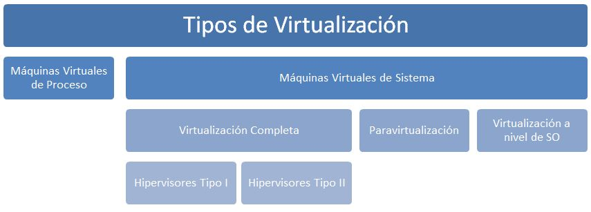
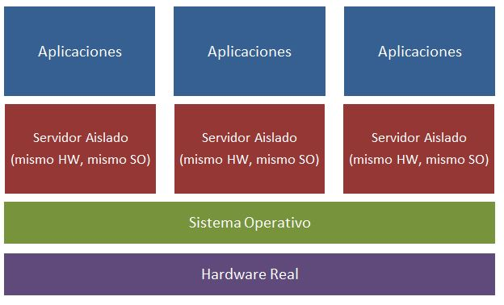
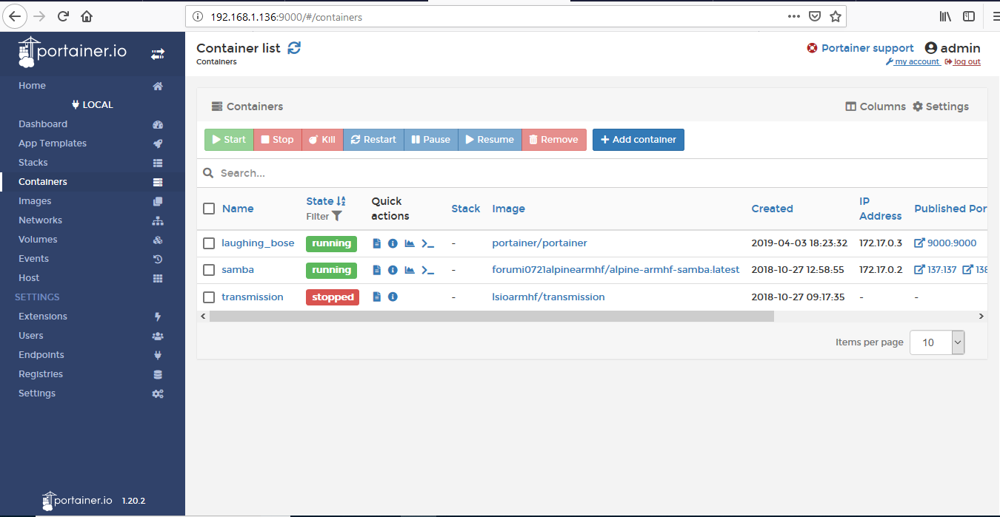

# DOCKER

## Virtualización a nivel de Sistema Operativo
Cuando hablamos de virtualización podemos hacer referencia a muchas técnicas distintas que se utilizan para abstraer el hardware del ordenador como si fuera una máquina totalmente autónoma. Se hace a partir del encapsulamiento proporcionado por una capa de software que funciona de una manera u otra dependiendo de la técnica que empleemos para virtualizar. Una de estas técnicas de virtualización de sistemas es la virtualización a nivel de sistema operativo (Operating-system-level virtualization).

La **virtualización a nivel de sistema operativo** también llamada contenerización, es un método de virtualización de servidor en el cual el kernel de un sistema operativo permite que existan múltiples instancias aisladas de espacios de usuario, en lugar de solo uno. A estas instancias las llamamos contenedores.

En la virtualización a nivel de sistema operativo es el propio sistema operativo de la máquina real el encargado de aislar los recursos y proporcionar las herramientas para crear, manipular o controlar el estado de los contenedores. Contenedores es el término que se utiliza en lugar de máquina virtual.

Los contenedores normalmente conllevan menos sobrecarga que la virtualización completa, son muchísimo más ligeros que una máquina virtual, pero son mucho menos flexibles a la hora de virtualizar sistemas operativos e imposibilitan la emulación de un hardware distinto al real.

Existen varias soluciones de virtualización a nivel de sistema operativo. Algunas de ellas son Docker, LXC (Linux Containers), OpenVZ, etc.

Docker se ha convertido en una herramienta popular, que funciona tanto en Windows, como Linux y MacOS. Es potente, ligera y con una gran cantidad de imágenes (plantillas) disponibles en la red sobre la que crear contenedores.

## Instalación de Docker
El proceso de instalación de Docker en una Raspberry Pi es similar al de un ordenador de escritorio o servidor, pero es necesario hacer una serie de pasos debido a las características del sistema operativo funcionando bajo la arquitectura arm de la Raspberry.

Hay un método rápido de instalación mediante la descarga y ejecución de un script que veremos en otro proyecto ([Docker Swarm](./p12swarm.md))

En primer lugar comprobamos la versión del sistema instalado, la release y su nombre en clave:

    $ cat /etc/debian_version
    10.1

    $ cat /etc/os-release
    PRETTY_NAME="Raspbian GNU/Linux 10 (buster)"
    NAME="Raspbian GNU/Linux"
    VERSION_ID="10"
    VERSION="10 (buster)"
    VERSION_CODENAME=buster
    ID=raspbian
    ID_LIKE=debian
    HOME_URL="http://www.raspbian.org/"
    SUPPORT_URL="http://www.raspbian.org/RaspbianForums"
    BUG_REPORT_URL="http://www.raspbian.org/RaspbianBugs"

    $ lsb_release -cs
    buster

Ya sabemos que tenemos un sistema operativo de nombre raspbian basado en la versión 10.1 de Debian (cuyo nombre en clave es buster). Nos hará falta saberlo para descargar Docker.

El proceso comienza descargando una serie de paquetes necesarios:

    $ sudo apt update
    $ sudo apt install -y apt-transport-https ca-certificates curl gnupg2 software-properties-common

A continuación obtenemos la clave firmada para la descarga de los paquetes de Docker:

    $ curl -fsSL https://download.docker.com/linux/raspbian/gpg | sudo apt-key add -

Añadimos el repositorio oficial de Docker a nuestra lista de repositorios (aquí ponemos de manera automática la release que estamos gastando y de manera manual la arquitectura de la raspberry - armhf-):

    $ echo "deb [arch=armhf] https://download.docker.com/linux/raspbian $(lsb_release -cs) stable" | sudo tee -a /etc/apt/sources.list.d/docker.list

Procedemos con la instalación de Docker:

    $ sudo apt update
    $ sudo apt install docker-ce

Sólo queda activar el servicio para que se ejecute en el arranque e iniciarlo:

    $ sudo systemctl enable docker
    $ sudo systemctl start docker

Si deseamos ejecutar Docker con un usuario sin privilegios debemos añadir dicho usuario al grupo docker. En nuestro caso se trata del usuario pi y lo hacemos con el lanzamiento del siguiente comando:

    $ sudo usermod -aG docker pi

Una vez añadido, reiniciamos el demonio de Docker con:

    $ sudo systemctl restart docker

Para que los cambios surtan efecto en nuestro sistema debemos cerrar sesión y volver a entrar.

Para ver que Docker está funcionando podemos empezar por comprobar la información del servidor docker mediante la acción info:

    $ docker info

## Imágenes en Docker
Para trabajar con contenedores es necesario conocer el concepto de imágenes. Un contenedor depende de una imagen para funcionar. Cuando se crea un contenedor se basa en el contenido de una imagen, como si fuera una plantilla base. Los cambios y tareas que se realicen en el contenedor solo se verán reflejados en el mismo, y no en la imagen original.

Varios contenedores ejecutándose simultáneamente pueden estar basados en la misma imagen. Un ejemplo podría ser una imagen de Debian. Podríamos crear un contenedor sobre esa imagen para poder virtualizar ese sistema operativo y probarlo y añadir servicios. Podríamos crear otro contenedor distinto sobre esa misma imagen de manera que tendríamos otro Debian nuevo sobre el que poder añadir programas y servicios distintos.

Podríamos incluso descargar una imagen en la que ya está instalado, configurado y listo para utilizar un servidor con un Apache, o un Moodle o cualquier otro programa o servicio que se nos ocurra sin importarnos siquiera sobre qué sistema operativo corre.

Existen multitud de imágenes listas para ser descargadas en el Hub de docker (https://hub.docker.com/). Este es un repositorio donde es posible buscar imágenes, ver cómo utilizarlas y obtener información de ellas. Podemos acceder a este repositorio desde la web y copiar el comando necesario para descargar la imagen o directamente buscar la imagen y descargarla desde el Shell de docker. Es importante fijarnos en la arquitectura sobre la que corren estas imágenes. Puesto que estamos utilizando una Raspberry Pi, sólo podremos descargar imágenes que funcionen con la arquitectura armhf.

En primer lugar podemos comprobar qué imágenes tenemos descargadas:

    $ docker images

Obviamente si acabamos de instalar docker no nos aparecerá ninguna imagen descargada en nuestro equipo.
Para eliminar imágenes de nuestro disco utilizamos el mandato rmi. El único requisito es que no exista ningún contenedor asociado a la imagen que queremos eliminar:

    $ docker rmi imagen

Para buscar imágenes del repositorio oficial lo podemos hacer de 2 maneras. La primera consiste en acceder a la web del Hub de Docker (https://hub.docker.com/) y ahí buscar la imagen deseada. Nos dirá el nombre de la misma y el comando (pull) a ejecutar para la descarga.

La otra opción es la de buscarla directamente desde la línea de mandatos mediante el comando search. Vamos a buscar las imágenes que aparezcan con la palabra http (servidor web):

    $ docker search --limit 5 http

Le estamos indicando que sólo nos muestre los 5 primeros resultados de la búsqueda. El resultado es el siguiente:

    NAME                         DESCRIPTION                                     STARS               OFFICIAL            AUTOMATED
    httpd                        The Apache HTTP Server Project                  2786                [OK]
    steveltn/https-portal        A fully automated HTTPS server powered by Ng…   79                                      [OK]
    centos/httpd-24-centos7      Platform for running Apache httpd 2.4 or bui…   27
    geldim/https-redirect        Very small (4mb) http to https redirector       17                                      [OK]
    aequitas/http-api-resource   Concourse resource to allow interaction with…   2                                       [OK]

Una vez localizada la imagen que deseamos, sólo falta descargarla mediante el comando pull. En nuestro caso el nombre es httpd:

    $ docker pull httpd

Comprobamos que la tenemos descargada:

    $ docker images

Es interesante comprobar la información que nos muestra, como el ID de imagen y el tamaño de la misma.

Y si deseáramos borrar la imagen:

    $ docker rmi httpd

## Contenedores
Una vez descargada la imagen es hora de crear nuestra "máquina virtual", es decir, el contenedor.

Para crear un contenedor tenemos 2 comandos. El comando create crea un contenedor a partir de una imagen pero no lo ejecuta. El comando run crea y ejecuta un contenedor.

La sintaxis del comando create es la siguiente:

*docker create –\[opciones] imagen \[comando]*

En caso de que la imagen no estuviera descargada, el comando create la descargará. Al contenedor creado se le asignará un identificador de 64 caracteres (se suelen mostrar 12) que nos mostrará por pantalla y que será necesario para futuras operaciones que hagamos con él.

Como norma general, el comando run lo ejecutaremos así:

*sudo docker run -d -p puerto_real:puerto_container imagen*

Es importante el mapeo de puertos, en el que si es necesario que nuestro contenedor utilice algún puerto (por ejemplo el 80 en un servidor web) le indiquemos a qué puerto de nuestra máquina lo queremos mapear (normalmente también el 80).

Como ejemplo:

    $ docker run -ti debian cat /etc/debian_version

Este comando creará un contenedor y lo ejecutará a partir de una imagen llamada debian. Si la imagen no está descargada, automáticamente docker la descargará del repositorio.

Podemos comprobar que se ha descargado automáticamente la imagen de Debian:

    $ docker images

Una vez creado el contenedor se ejecutará dentro del mismo la orden cat/etc/debian_version. Como este comando termina su ejecución de visualizar la versión de la distribución, el contenedor se detendrá. Las opciones -ti indican que se ha de iniciar el contenedor con la posibilidad de acceder al terminal (-t) y que se ha de iniciar el contenedor en modo intearctivo (-i).

Para ver los contenedores que tenemos arrancados ejecutamos el siguiente comando:

    $ docker ps

Nos muestra que no hay ningún contenedor iniciado, pues el que hemos arrancado, al ejecutar el comando que le hemos dicho (cat /etc/debian_version), se ha detenido. Podemos ver todos los contenedores creados con la opción -a y veremos que ahora sí que nos aparece, pero con status finalizado (exited):

    $ docker ps -a

    CONTAINER ID        IMAGE               COMMAND                  CREATED             STATUS                     PORTS               NAMES
    5236ee7ce660        debian              "cat /etc/debian_ver…"   5 minutes ago       Exited (0) 5 minutes ago                       magical_keller

Como podemos observar se le ha asignado un ID automáticamente (5236ee7ce660), y puesto que no le hemos dado ningún nombre al crearlo, se le ha dado también un nombre aleatorio (magical_keller).

Podemos utilizar este ID y nombre para referenciarlos. A la hora de utilizar el ID no es necesario teclear todos los dígitos, basta con utilizar los primeros que sean suficientemente significativos para no llevar a confusión.

Para borrar un contenedor utilizamos el mandato rm e identificaremos el contenedor a eliminar con los primeros dígitos del ID:

    $ docker rm 523

## Servidor WEB
Vamos a crear y correr un contenedor con un servidor web. Vamos a contenerizar el servidor web Apache, de manera que se ejecute en un entorno aislado, sin interferir con otros servidores web que pudiéramos estar corriendo en nuestra máquina.

En primer lugar descargamos la imagen del servidor web Apache desde el hub de Docker. Este paso no es necesario, pues ya hemos visto que al crear un contenedor se descargaría automáticamente la imagen indicada en caso de no estar ya descargada. La imagen del servidor web Apache se llama httpd.

    $ docker pull httpd

Puesto que vamos a contenerizar un servidor web, vamos a crear primero un directorio en el que almacenaremos los ficheros de la página web. Aunque no es el lugar donde debería ir, ese directorio lo vamos a crear en nuestra carpeta personal (que si no hemos cambiado de directorio es donde nos encontramos). Lo llamamos www:

    $ mkdir www

El siguiente paso es crear e iniciar  el contenedor con el comando run:

    $ docker run -dit --name servidor-apache -p 80:80 -v "$PWD"/www:/usr/local/apache2/htdocs/ httpd

Con la opción -dit lanzamos el contenedor en modo background, para que se ejecute en segundo plano y nos permita terminal. Le asignamos un nombre (servidor-apache en este caso), redireccionamos el puerto 80 del contenedor al puerto 80 de nuestra Raspberry, y mapeamos el directorio que habíamos creado ($PWD/www) al directorio del contenedor que contendrá la raíz de nuestra web (/usr/local/apache2/htdocs). Lo último que le indicamos es la imagen que debe coger para crear el contenedor (httpd).

Antes de probarlo vamos a crear una página de muestra en el directorio que habíamos creado para comprobar que todo funciona. Para crear el fichero index.html en el directorio en el que nos encontramos tecleamos lo siguiente:

    $ echo '<html><body><h1>Hola Mundo!</h1></html>' > www/index.html

Tras unos segundos podemos acceder mediante un navegador a la dirección de la Raspberry por el puerto 80 (o el que le hayamos indicado), y al haber mapeado el puerto de nuestra Raspberry con el del contenedor estaremos accediendo al puerto 80 del servidor que estamos virtualizando. Debemos visualizar el mensaje que hayamos puesto en el fichero index.html

## Portainer
Portainer es una interfaz de usuario web que nos permite administrar fácilmente nuestro host Docker y todos los contenedores que en él habitan. Portainer tiene como una de sus ventajas principales su facilidad de uso. Consiste en un solo contenedor que puede ejecutarse en cualquier motor de Docker o un cluster Swarm, tanto en Linux, como en Windows, o incluso una Raspberry Pi.

Puesto que Portainer se ejecuta como un contenedor ligero, para instalarlo basta con ejecutar las 2 siguientes líneas:

    $ docker volume create portainer_data

    $ docker run -d -p 9000:9000 -v /var/run/docker.sock:/var/run/docker.sock -v portainer_data:/data portainer/portainer

Y una vez instalado acceder mediante un navegador a la dirección IP de nuestro host por el puerto :9000

Desde la interfaz web podremos crear, arrancar, parar o eliminar contenedores, así como gestionar las imágenes e incluso crearlas desde algún contenedor o desde un Dockerfile. También podemos administrar las redes y los volúmenes. Como añadido, incluye también plantillas con posibilidad de descarga de contenedores populares.

Una aplicación imprescindible para la gestión de Docker.

## Coder
Coder es un proyecto gratuito y de código abierto que convierte un Raspberry Pi en una plataforma sencilla que se puede utilizar para enseñar los fundamentos de la programación web. Es un entorno de desarrollo web que funciona en un navegador en el que se pueden crear pequeños proyectos en HTML, CSS y JavaScript, directamente desde el navegador web.

Para instalar Coder podemos optar por una instalación clásica, descargando e instalando los paquetes necesarios, o en nuestro caso, optamos por la descarga de un contenedor en el que ya está instalado Coder.

Para descargar la imagen y ejecutar el contenedor ejecutamos el siguiente mandato:

    $ docker run -d -p 8081:8081 resin/rpi-google-coder

Para trabajar con él, accedemos mediante un navegador a la dirección de nuestra Raspberry, pero ojo, mediante una conexión https y por el puerto 8081

Nos pedirá que confirmemos la excepción de seguridad, y tras hacerlo ya podemos validarnos en el Coder de nuestra RPi.
