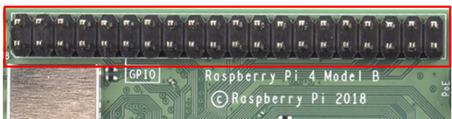
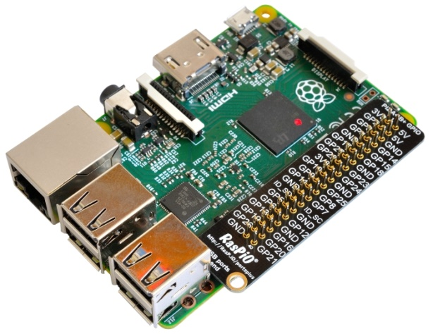
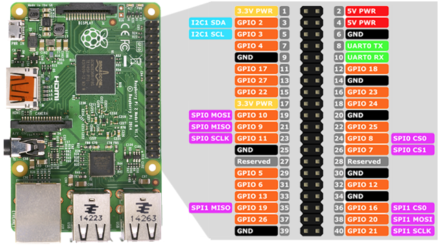
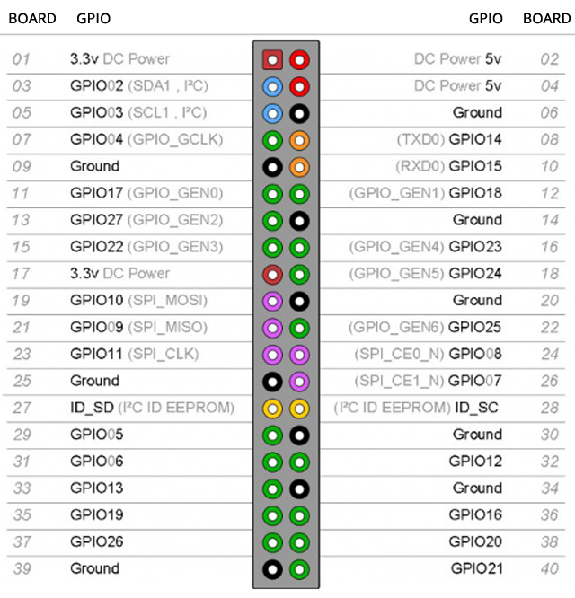
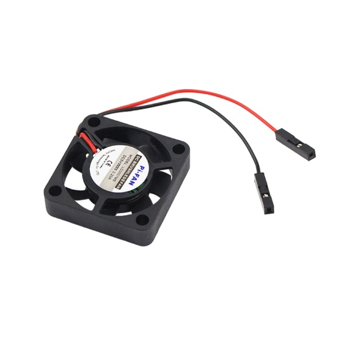
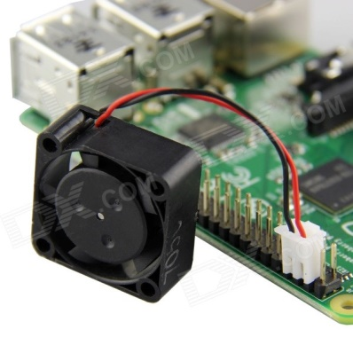
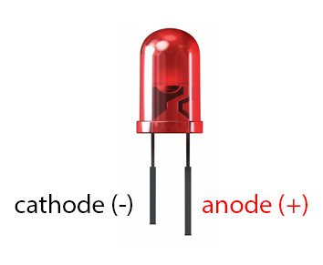
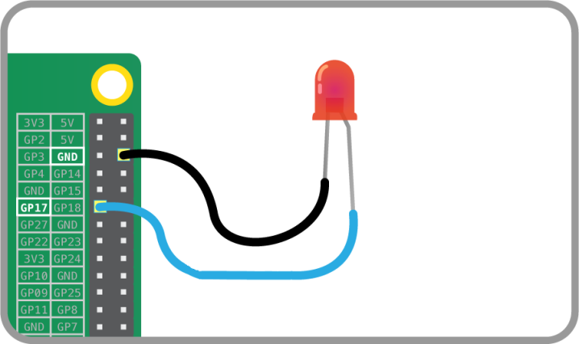

# Los puertos GPIO

Interactuando con el mundo exterior a través de los puertos GPIO de nuestra Raspberry Pi.

## Los pines GPIO

Una de las características principales de la Raspberry Pi es la incorporación de 40 pines de Entrada/Salida de propósito general o GPIO (General Purpose Input/Output) que se pueden programar por el usuario y que permiten la conexión de diversos sensores y componentes electrónicos. 

Estos pines o conexiones se pueden usar como entradas o salidas para múltiples usos. Por ejemplo, podríamos conectar sensores de temperatura, de proximidad, de detección de movimiento, de humedad, etc, que actuarían como entradas y programar la RPi para dar órdenes por los pines de salida a dispositivos como motores, leds, relés, etc.

Estos pines están incluidos en todos los modelos de Raspberry Pi aunque con diferencias. Hay que tener en cuenta que dependiendo del modelo de la Raspberry Pi encontramos una cantidad de pines diferentes, por ejemplo, en la versión 1 de Raspberry Pi se tenían 26 pines GPIO mientras que a partir de la versión 2 de Raspberry Pi el número de pines aumentó a 40. Sin embargo la compatibilidad es total, puesto que los 26 primeros pines mantienen su función original.

Los pines GPIO tienen funciones específicas (aunque algunos comparten funciones) y se pueden agrupar de la siguiente manera:
- **Amarillo** (2): Alimentación a 3.3V.
- **Rojo** (2): Alimentación a 5V.
- **Naranja** (26): Entradas / salidas de propósito general. Pueden configurarse como entradas o salidas. **Hay que tener presente que el nivel alto es de 3.3V y no son tolerantes a tensiones de 5V.**
- **Gris** (2): Reservados.
- **Negro** (8): Conexión a GND o masa.
- **Azul** (2): Comunicación mediante el protocolo I2C para comunicarse con periféricos que siguen este protocolo.
- **Verde** (2): Destinados a conexión para UART para puerto serie convencional.
- **Morado** (5): Comunicación mediante el protocolo SPI para comunicarse con periféricos que siguen este protocolo.

**Todos los pines son de tipo "unbuffered", es decir, no disponen de buffers de protección y podemos dañar la placa con un mal uso.**

Existen 2 formas de numerar los pines de la Raspberry Pi, en modo GPIO o en modo BCM.
- En el **modo Board**, los pines se numeran de forma física por el lugar que ocupan en la placa viene siendo igual para todas las versiones (comenzamos a contar desde arriba a la izquierda y finalizamos abajo a la derecha).
- En el **modo BCM**, los pines se numeran por la correspondencia en el chip Broadcom (que es la CPU de la Raspberry Pi).

Por este mismo motivo podemos encontrar 2 nomenclaturas a la hora de realizar las prácticas de electrónica con Raspberry Pi, cuando nos refiramos al modo GPIO o al modo BCM. A continuación una tabla de equivalencias:

De los pines GPIO disponibles, hay una serie de pines con capacidad de PWM (simulación de una señal analógica mediante una señal digital). Sin embargo no se dispone de ningún convertidor de analógico a digital. Esto quiere decir que para medir valores de sensores analógicos necesitaremos utilizar un convertidor externo.
 
**Advertencias**

Cuando se utilizan los pines de GPIO hay que poner mucho cuidado para no dañar la propia Raspberry Pi. Es muy importante comprobar los niveles de tensión y la corriente solicitada. Los pines de GPIO pueden generar y consumir tensiones compatibles con los circuitos de 3.3V, como la nueva electrónica. No conectar nunca componentes de 5V, o podemos quemar el chip y dañar la Raspberry Pi.

Hay que tener presente que la intensidad de corriente que sale de esos pines proviene de la fuente de 3.3V y esta fue diseñada para una carga de unos 3mA por cada pin GPIO, suficiente para encender diodos led, pero poco más.

## Conexión de un sistema de refrigeración
Hemos visto que hay 2 pines (los amarillos números 1 y 17) que proporcionan una salida de corriente de 3,3v y 2 pines más (los rojos 2 y 4) que proporcionan una salida de corriente de 5v. Además existen 8 pines (los negros) de conexión a masa (GND).

Con todos estos pines es posible alimentar componentes que necesiten 3,3v o 5v Dependiendo de qué voltaje necesitemos lo conectaremos a un pin u otro. 

OJO, no confundir este pin de 5v con los otros 26 pines de entrada/salida de propósito general (GPIO colores naranja) que generan y consumen corrientes de 3,3v. Es ahí donde no podremos conectar componentes de 5v.
Un componente que se suele conectar a la placa es un ventilador de refrigeración para una caja que albergue la Raspberry o para un rack de Raspberrys.

Estos ventiladores están diseñados para acoplarlos a la Raspberry y normalmente necesitan una alimentación de 5v.

Para conectarlo, simplemente acoplaremos los cables a los pines de alimentación de la RPi. Puesto que necesitan 5v utilizaremos indistintamente uno de los pines 2 ó 4.

Elegimos el pin 4 para la alimentación de los 5v y, de entre los pines GND, elegimos el 6 que es el que está justo pegado al 4. De este modo tenemos los 2 cables conectados juntos.

En la electrónica, como norma general, se suele utilizar el cable de color rojo para la alimentación de 5v (polo +) y el cable negro el de conexión a tierra (polo -). 

Por tanto conectaremos el **cable rojo del ventilador al pin 4 y el cable negro al pin 6**.

## Control de los puertos GPIO mediante la consola
Vamos ahora a utilizar los puertos programables de GPIO con el fin de dar órdenes mediante esos puertos a dispositivos conectados (motores, relés, leds, …) o hacer lecturas de sensores conectados a esos puertos.

Raspbian permite acceder a estos GPIO como si fuesen directorios y ficheros y mandar órdenes a estos pines será tan sencillo como escribir en un fichero.

El sistema ha creado un directorio especial en /sys/class/gpio en el que están los subdirectorios y ficheros que necesitamos para interactuar con los pines.

Veamos cómo utilizarlos para encender un led.

En primer lugar vamos a conectar un led a la Raspberry. Los leds que se utilizan habitualmente con este tipo de placas (y con las Arduino) funcionan con un voltaje de entre 2 y 4 voltios. Dependiendo del led (incluso del color) necesitan una corriente u otra. Los pines GPIO nos sacarán un voltaje de 3,3v. Habría que mirar la hoja de especificaciones del led para saber a qué corriente operan y en base a eso y al voltaje que nos proporciona la Raspberry, calcular la resistencia que debemos poner al led para que funcione de manera óptima y no se funda.

*En esta práctica, puesto que los leds operan en voltajes próximos a los 3,3v y el circuito que vamos a montar es un circuito sencillo, vamos a prescindir de las resistencias, montando directamente el led a la placa, aunque ello implique que el led no funcione óptimamente y pudiera recalentarse o fundirse por sobretensión.*

Los leds tienen polaridad y es importante respetarla. El pin más largo es el ánodo (polaridad positiva), y el más corto es el cátodo (polaridad negativa):

Por tanto, el terminal más largo (+) será el que conectaremos a uno de los pines GPIO programables y el terminal más corto (-) será el que conectaremos a masa (GND).

Vamos a elegir como pin programable el GPIO17 (pin 11) y como GND el pin 6.

Una vez conectado el terminal largo del led al pin 11 y el corto al pin 6 de la Raspberry, vamos a controlarlos desde la consola de comandos escribiendo en archivos y directorios dentro de */sys/class/gpio*.

Vamos a utilizar el mandato *echo* para escribir, y redireccionaremos con el símbolo > la salida al fichero que le especifiquemos.

Lo primero que vamos a hacer es indicar qué pines son accesibles. Vamos a seguir la numeración BCM. Queremos tener acceso al GPIO 17, así que introducimos el siguiente comando:

    pi@raspberrypi:~ $ echo 17 > /sys/class/gpio/export

Tras esto, el sistema ha creado un archivo con una estructura GPIO que corresponde al número 17. A continuación, tenemos que informar a la Raspberry Pi de si el pin va a ser de salida (out) o de entrada (in). Como lo que queremos es encender un LED, el GPIO 17 será de salida. Introducimos el siguiente comando:

    pi@raspberrypi:~ $ echo out > /sys/class/gpio/gpio17/direction

Con esto, el sistema ya sabe que el pin será de salida. Ahora tendremos que darle valores. Existen dos posibles: '0' y '1'.

Para encender el LED:

    pi@raspberrypi:~ $ echo 1 > /sys/class/gpio/gpio17/value

Para apagar el LED:

    pi@raspberrypi:~ $ echo 0 > /sys/class/gpio/gpio17/value

Una vez hayamos acabado de encender y apagar el LED, tendremos que eliminar la entrada GPIO creada, es decir, el GPIO 17. Para ello introduciremos el siguiente comando:

    pi@raspberrypi:~ $ echo 17 > /sys/class/gpio/unexport

## Control de los puertos GPIO mediante Python
Python es un lenguaje de programación muy popular cuya filosofía hace hincapié en que su código sea fácilmente legible. Es un lenguaje interpretado y multiplataforma, es decir, no se necesita compilar el código fuente, sino que el mismo código fuente se interpreta en cada plataforma en el momento de la ejecución.

Es un lenguaje ideal para scripting y viene ya instalado en Raspbian. Además, incorpora unas librerías para poder utilizar fácilmente los pines GPIO y que vamos a utilizar.

Vamos a crear un pequeño programa en Python que simule el funcionamiento de un semáforo.

En primer lugar vamos a conectar 3 leds (rojo, amarillo y verde) a los pines de la Raspberry. Ya sabemos que debemos conectar el ánodo (+) a un pin GPIO y el  cátodo (-) a un pin GND.

Podemos elegir cualquier pin. Por ejemplo elegimos los siguientes:
- Verde:
    - Ánodo +: pin 11 (GPIO 17)
    - Cátodo -: pin 9 (GND)
- Rojo:
    - Ánodo +: pin 12 (GPIO18)
    - Cátodo -: pin 14 (GND)
- Amarillo:
    - Ánodo +: pin 18 (GPIO24)
    - Cátodo -: pin 20 (GND)

Una vez tenemos las conexiones, vamos a programar el control del semáforo. En primer lugar creamos con el editor de texto un fichero con la extensión .py que albergará el código fuente del programa:

    pi@raspberrypi:~ $ nano semaforo.py

Tecleamos dentro el siguiente programa:

    #!/usr/bin/python

    # Declaramos las librerias a utilizar
    import RPi.GPIO as GPIO
    import time

    # Utilizamos la nomenclatura BOARD (podemos usar la BCM)
    GPIO.setmode(GPIO.BOARD)

    # Definimos los pines que tenemos conectados los leds como de salida
    GPIO.setup(11, GPIO.OUT)
    GPIO.setup(12, GPIO.OUT)
    GPIO.setup(18, GPIO.OUT)

    # Encendemos el led verde (pin 11, BCM 17) y apagamos el resto
    GPIO.output(11, GPIO.HIGH)
    GPIO.output(12, GPIO.LOW)
    GPIO.output(18, GPIO.LOW)

    # Esperamos 5 segundos
    time.sleep(5)

    # Encendemos el led amarillo (pin 18, BCM 24) y apagamos el resto
    GPIO.output(11, GPIO.LOW)
    GPIO.output(12, GPIO.LOW)
    GPIO.output(18, GPIO.HIGH)

    # Esperamos 5 segundos
    time.sleep(5)

    # Encendemos el led rojo (pin 12, BCM 18) y apagamos el resto
    GPIO.output(11, GPIO.LOW)
    GPIO.output(12, GPIO.HIGH)
    GPIO.output(18, GPIO.LOW)

    # Esperamos 5 segundos
    time.sleep(5)

    # Limpiamos toda la informacion de los pines para dejarlo como estaba inicialmente
    GPIO.cleanup()

Una vez creado, guardamos el fichero y ejecutamos el programa con la siguiente instrucción:

    pi@raspberrypi:~ $ python semaforo.py

O bien lo ejecutamos en segundo plano añadiendo el símbolo & al final de la línea:

    pi@raspberrypi:~ $ python semaforo.py &

