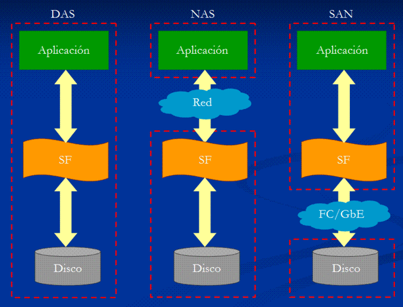

# DISCO NAS CON OMV

## OpenMediaVault
OpenMediaVault (OMV) es una solución de software libre que corre bajo Linux diseñada para almacenamiento conectado a la red (NAS) con una administración bajo un entorno amigable vía web.

Ya conocemos los 3 modos de conexión del almacenamiento a los servidores. Estas 3 tecnologías son **DAS** (Direct Attached Storage), **NAS** (Network Attached Storage) y **SAN** (Storage Area Network). 

Tanto en DAS (Direct Attached Storage) como en SAN (Storage Area Network), las aplicaciones y programas de usuarios hacen sus peticiones de datos al sistema de ficheros directamente y éste accede al disco a nivel de bloques. En el lado opuesto se encuentra la tecnología NAS (Network-attached storage), donde las aplicaciones hacen las peticiones de datos a los sistemas de ficheros de **manera remota**.

**NAS** es una tecnología de almacenamiento en la que el dispositivo de almacenamiento (el disco NAS) se conecta al servidor (o a los equipos clientes) a través de una red (normalmente TCP/IP), haciendo uso de un Sistema Operativo optimizado para dar acceso con los protocolos CIFS, NFS, FTP o TFTP, SSH , rsync , iSCSI , AFP y TFTP.

A diferencia de DAS y de SAN que se trabajan con bloques de disco, los protocolos de comunicaciones NAS **están basados en archivos** por lo que el cliente solicita el archivo completo al disco NAS y lo maneja localmente.

Los protocolos usados son protocolos de compartición de archivos como NFS o Microsoft Common Internet File System (CIFS o SMB).

Los sistemas NAS necesitan de un sistema de archivos corriendo en el dispositivo de almacenamiento, por ello suelen llevar en el dispositivo un sistema operativo embebido (como puede ser Linux, FreeNAS, …). Nosotros vamos a utilizar OpenMediaVault corriendo bajo Raspbian para gestionar este almacenamiento remoto.

OMV incorpora las siguientes características:
- Interfaz gráfica de usuario multilenguaje basada en la web.
- Protocolos: CIFS (a través de Samba ), FTP, NFS (versiones 3 y 4), SSH, rsync, iSCSI , AFP y TFTP.
- Software-RAID ( niveles 0, 1, 4, 5, 6 y 10) .
- Monitoreo.
- Informes estadísticos por correo electrónico. 
- Sistemas de archivos : ext2 , ext3 , ext4 , Btrfs , XFS , JFS , NTFS , FAT32 
- Cuotas de disco.
- Gestión de usuarios y grupos. 
- Controles de acceso vía ACL.

## Instalación de OpenMediaVault
Para la instalación de OMV podemos optar por descargar una imagen de Raspbian con OMV ya instalado y listo para ejecutar, o partir de una instalación de Raspbian e instalar manualmente OMV.

Vamos a hacer la instalación manual. Para ello, una vez arrancada la RPi y conectados mediante ssh procedemos a ejecutar los siguientes comandos.

En primer lugar actualizamos los repositorios:

    $ sudo apt-get update

A continuación actualizamos el sistema operativo:

    $ sudo apt-get upgrade

(en un momento dado deberemos pulsar q)

Reiniciamos el sistema:

    $ sudo reboot

Descargamos desde el repositorio de GitHub el script de instalación y lo ejecutamos:

    $ wget -O - https://github.com/OpenMediaVault-Plugin-Developers/installScript/raw/master/install | sudo bash

## Acceso a OMV
Una vez instalada y puesta en marcha la aplicación, accedemos vía web a la Raspberry.

Nos solicita un usuario y una contraseña. Por defecto son:
- usuario: **admin**
- contraseña: **openmediavault**

Ya estamos dentro:

Accedemos a la opción *Discos*:

Si no lo hemos hecho antes, podemos conectar ahora vía USB nuestro disco duro extraíble (o cualquier otro medio de almacenamiento externo) y pulsamos sobre el botón *Scan* para que vuelva a examinar los discos y lo reconozca.

Una vez reconocido el disco, vamos a proceder a su montaje. Para ello, en el menú de la izquierda vamos a la opción *Sistema de Archivos*.

Pulsamos sobre el nuevo disco y seleccionamos la opción *Montar*.

Aplicamos los cambios:

El siguiente paso será compartir las carpetas del disco que deseemos. Partimos de que ya tenemos carpetas creadas en el disco con contenido listo para ser compartido.

Nos vamos al menú del panel de navegación y seleccionamos *Carpetas Compartidas*.

Pulsamos sobre la opción *Añadir*.

En la ventana nos solicita un nombre del recurso a compartir, nos pide el disco donde está la carpeta a compartir y por último seleccionamos la carpeta con el menú desplegable. Podemos cambiar los permisos. Una vez rellena, pulsamos sobre *Salvar*.

Volvemos a pulsar sobre *Aplicar* los cambios en la configuración.

Una vez indicada la carpeta o carpetas a compartir, el último paso es habilitar el protocolo SMB/CIFS para la compartición de datos.

Accedemos a la opción *SMB/CIFS* del apartado Servicios del menú principal y activamos el protocolo.

Pulsamos *Salvar* y Aplicamos los cambios en la configuración.

A continuación entramos en la pestaña de *Compartidos* de esa misma ventana.

Añadimos la carpeta compartida.

Pulsamos *Salvar* y Aplicamos los cambios en la configuración.

## Creación de Usuarios
Vamos a crear usuarios para gestionar los accesos a las distintas carpetas compartidas.

Por defecto OMV trabaja con los usuarios del sistema Linux sobre el que reside, en nuestro caso Raspbian. Vamos a crear un nuevo usuario, por ejemplo, uno llamado samba. Este usuario se creará en el sistema Raspbian como un usuario normal del sistema.

Accedemos a la opción *usuario* del menú principal.

Y pulsamos sobre *Añadir*,

Ponemos un nombre, una contraseña y seleccionamos el shell para iniciar sesión desde consola.

Aplicamos los cambios en la configuración.

Volvemos a la carpeta compartida y asignamos permisos al usuario que acabamos de crear.

Seleccionando la carpeta antes compartida, pulsamos sobre *Privilegios*.

Seleccionamos el permiso deseado para el usuario *samba*.

Pulsamos *Salvar* y aplicamos los cambios en la configuración.

## Acceso a las carpetas compartidas desde Windows
Una vez compartida la carpeta, vamos a acceder al disco NAS desde otro equipo. Vamos a hacerlo desde un equipo con Windows 10 instalado y por tanto mediante el protocolo CIFS.

Abrimos el explorador de Windows y accedemos a la Red. Debe aparecernos nuestra Raspberry automáticamente.

Al hacer doble clic nos aparece una ventana con la solicitud de las credenciales válidas en la Raspberry. Nos validamos con el usuario que acabamos de crear (*samba*).

Y ya tenemos acceso al contenido compartido.

