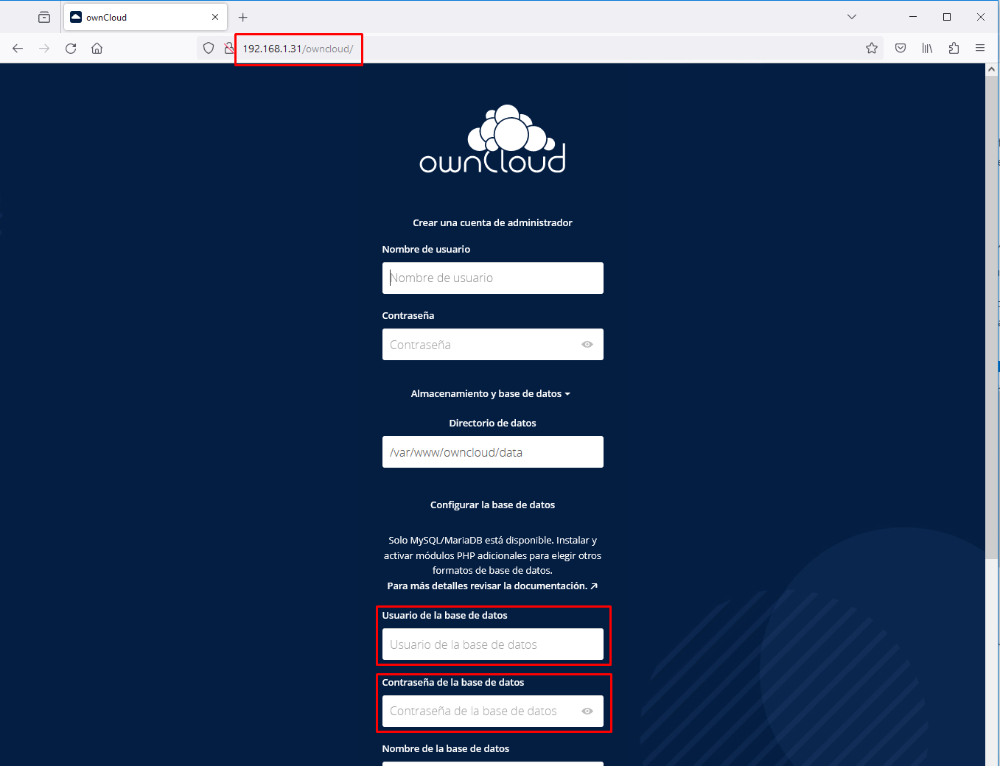
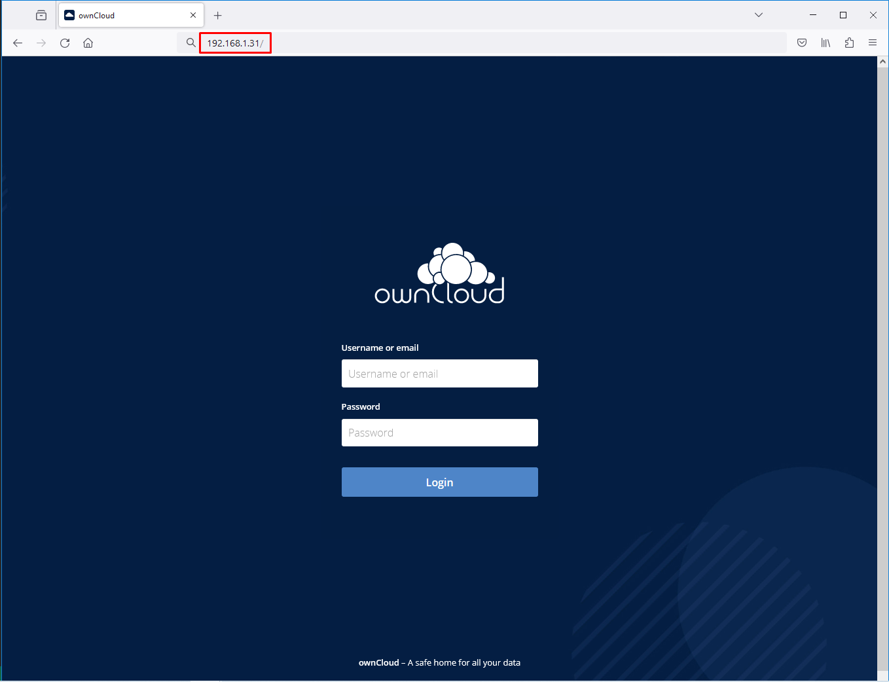
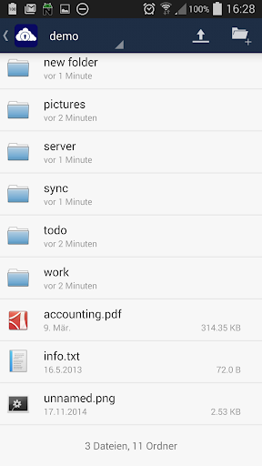

# Nube privada con ownCloud
{: .no_toc }

<details open markdown="block">
  <summary>
    Tabla de contenidos
  </summary>
  {: .text-delta }
- TOC
{:toc}
</details>

## ownCloud
ownCloud es una aplicación de software libre del tipo Servicio de alojamiento de archivos, que permite el almacenamiento en línea y aplicaciones en línea. Para hacernos una idea, nos permite tener nuestro propio servidor de almacenamiento online como si fueran los populares servicios Dropbox, Google Drive o OneDrive. La ventaja es que vamos a poder hacerlo en nuestro servidor local y sin límite de almacenamiento, y al ser software libre y gratuito, podemos instalarlo sin ningún coste.


Nosotros vamos a instalar este software en nuestra Raspberry Pi, haciendo ésta de servidor, y pudiendo acceder a ella mediante una página web, una aplicación de escritorio o una app de dispositivo móvil, tal y como hacen los populares servicios de Dropbox, Google Drive, etc.

La instalación es algo compleja, pues para funcionar este programa necesita que instalemos un servidor web (Apache en nuestro caso), un gestor de base de datos (MariaDB en nuestro caso) y puesto que el programa está escrito en el lenguaje PHP, necesitamos también instalar los paquetes necesarios de este lenguaje de servidor.

Además de instalar los paquetes, habrá que configurar el servidor web Apache y el gestor de BBDD MariaDB.

Por último, habrá que descargar el propio programa de ownCloud, descomprimirlo, moverlo al directorio web, asignarle permisos y por último ejecutar la última fase automática de la instalación.

Son unos cuantos pasos que, aunque no son complejos, pueden darnos algún problema y son un poco costosos.

En contraposición podemos optar por hacer una instalación mucho más sencilla que consistirá en ejecutar la aplicación en un contenedor que ya viene con el servidor web y el gestor de base de datos preinstalado y configurado correctamente. Lo único que habrá que hacer será la descarga y ejecución del contenedor con un único comando.

{: .warning }
Vamos a ver las dos maneras de hacerlo y el profesor te indicará (dependiendo del tiempod isponible) si debes hacer la instalación de una manera o de ambas. En caso de tener que hacerlo de las dos maneras, haz primero la de Docker, pruebas su funcionamiento y después paras y eliminas el contenedor antes de continuar con la instalación clásica.

## Instalación clásica de ownCloud
Como hemos visto, el proceso de instalación de ownCloud en la raspberry es un tanto costoso, pues hay que instalar un Apache, PHP y MariaDB, además de la descarga e instalación del propio paquete de ownCloud.

Vayamos por pasos. En primer lugar actualizamos los repositorios:

    sudo apt update

Instalamos el servidor web Apache:

    sudo apt install apache2 -y

En este momento ya estamos en condiciones de abrir un navegador y acceder a la dirección IP de nuestra Raspberry Pi y nos saldrá la página por defecto que carga el servidor Web Apache.

Instalamos los paquetes necesarios relacionados con PHP. PHP es un lenguaje muy popular de programación web que en este caso es necesario para correr la aplicación de ownCloud. En primer lugar preparamos los repositorios y los certificados para validarnos en ese repositorio relacionados con PHP:

```
sudo apt -y install lsb-release apt-transport-https ca-certificates
```
```
sudo wget -O /etc/apt/trusted.gpg.d/php.gpg https://packages.sury.org/php/apt.gpg
```
```
echo "deb https://packages.sury.org/php/ $(lsb_release -sc) main" | sudo tee /etc/apt/sources.list.d/php.list
```
```
sudo apt update
```

Ya podemos descargar los paquetes necesarios de PHP:

    sudo apt install -y \
        libapache2-mod-php7.4 \
        openssl redis-server wget \
        php7.4 php7.4-imagick php7.4-common php7.4-curl \
        php7.4-gd php7.4-imap php7.4-intl php7.4-json \
        php7.4-mbstring php7.4-gmp php7.4-bcmath php7.4-mysql \
        php7.4-ssh2 php7.4-xml php7.4-zip php7.4-apcu \
        php7.4-redis php7.4-ldap php-phpseclib


A continuación instalamos el gestor de base de datos MariaDB:

    sudo apt install mariadb-server -y

Configuramos el usuario y la contraseña del administrador de la BBDD, sustituyendo el nombre del usuario **administrador** y la contraseña **password** por lo que deseemos:

```
sudo mysql
```

    CREATE USER IF NOT EXISTS 'administrador'@'localhost' IDENTIFIED BY 'password';
    GRANT ALL PRIVILEGES ON *.* TO 'administrador'@'localhost' WITH GRANT OPTION;
    SHOW GRANTS FOR 'administrador'@'localhost' ;

    exit

{: .important }
Recuerda bien el nombre del usuario y la contraseña de la Base de Datos que has puesto porque luego te hará falta.

Llega el momento de descargar el fichero *tar.bz2* con el programa ownCloud. 

En primer lugar nos situamos en el directorio donde el servidor web Apache almacena las páginas web:

    cd /var/www/

Descargamos el fichero *tar.bz2* con el programa ownCloud con el comando wget desde la página oficial:

    sudo wget https://download.owncloud.com/server/stable/owncloud-complete-20231213.tar.bz2

Descomprimimos el fichero tar.bz2 descargado:

    sudo tar -xjf owncloud-complete-20231213.tar.bz2

Cambiamos los permisos del directorio donde se almacenarán los datos subidos a ownCloud para que el usuario y el grupo propietario sea *www-data*, que será el usuario de Linux con el que interactuará el servidor web.

    sudo chown -R www-data:www-data owncloud

Cambiamos la configuración para el sitio web que vamos a colgar en el servidor web. Para ello editamos un nuevo fichero llamado owncloud.conf:

    sudo nano /etc/apache2/sites-available/owncloud.conf

Y ponemos el siguiente contenido:

    Alias /owncloud "/var/www/owncloud/"

    <Directory /var/www/owncloud/>
    Options +FollowSymlinks
    AllowOverride All

    <IfModule mod_dav.c>
    Dav off
    </IfModule>

    SetEnv HOME /var/www/owncloud
    SetEnv HTTP_HOME /var/www/owncloud

    </Directory>

Creamos un enlace a ese fichero pero en otro directorio:

    sudo ln -s /etc/apache2/sites-available/owncloud.conf /etc/apache2/sites-enabled/owncloud.conf

Reiniciamos el servidor web Apache:

    sudo systemctl restart apache2


## Instalación de ownCloud mediante un contenedor
Ya hemos visto todos los pasos que necesitamos ejecutar para la instalación de ownCloud en nuestra Raspberry Pi. Vamos a ver otro método de instalación más sencillo y que consiste en la utilización de un contenedor Docker. Necesitamos, por tanto, tener Docker instalado y ejecutándose en nuestra Raspberry Pi.

El contenedor se llama *owncloud/server*.

En primer lugar creamos el directorio donde almacenaremos los datos que suban a ownCloud los usuarios (por ejemplo a /srv/owncloud):

    sudo mkdir /srv/owncloud

Ejecutamos el contenedor sin necesidad de descargar la imagen. Docker lo hará por nosotros.

{: .warning }
Sustituye la IP que aparece en el comando por la IP de tu Raspberry Pi.

    docker run -d -p 80:8080 \
    -e OWNCLOUD_DOMAIN="192.168.1.99" \
    -e OWNCLOUD_TRUSTED_DOMAINS="192.168.1.99" \
    -e OWNCLOUD_ADMIN_USERNAME=owncloud \
    -e OWNCLOUD_ADMIN_PASSWORD=owncloud \
    -v /srv/owncloud:/mnt/data \
    owncloud/server

Al ejecutar el contenedor estamos indicando: 
- Que ejecute el contenedor en segundo plano (opción -d).
- El puerto a redireccionar el servidor web en nuestra máquina. El contenedor utiliza el 8080 (para evitar conflictos con otros servidores web), aquí le estamos indicando que accederemos por el 80 que es el estándar web.
- Que monte un volumen en el directorio que hemos creado */srv/owncloud* y que se mapee en el directorio */mnt/data* del servidor web del contenedor.
- Con la opción -e le pasamos 4 variables de entorno necesarias para la configuración de ownCloud. Son *OWNCLOUD_DOMAIN*, *OWNCLOUD_TRUSTED_DOMAINS*, *OWNCLOUD_ADMIN_USERNAME* y *OWNCLOUD_ADMIN_PASSWORD*. En las primeras le pasamos la dirección IP de nuestra Raspberry Pi y en las dos últimas el nombre del usuario administrador y su contraseña.

{: .warning }
Si el puerto 80 de la Raspberry está siendo ocupado por otro contenedor que hayamos ejecutado antes, docker nos informará del error y no arrancará este nuevo contenedor. Lo podemos solucionar eliminando previamente el contendor antiguo, o ejecutando este nuevo contenedor redireccionando el puerto 8080 de la Raspberry al puerto 8080 original del contenedor: `-p 8080:8080`

## Acceso a ownCloud
Una vez instalada y puesta en marcha la aplicación, accedemos vía web a la Raspberry para finalizar la instalación. Dependiendo del método de instalación que hayamos elegido, el último paso de instalación será de una manera o de otra. Si hemos optado por un contenedor, habrá que esperar unos segundos a que se complete la instalación antes de poder acceder vía web.

**Si hemos hecho la instalación normal:**

Accedemos mediante un navegador a la dirección IP de la Raspberry seguido del directorio */owncloud*
 
Nos pide un nombre de usuario para el administrador y una contraseña. Ponemos el que queramos.

{: .important }
En los campos de *Usuario de la base de datos* y *Contraseña de la base de datos* introducimos el usuario y contraseña que pusimos a la hora de configurar MariaDB. 
En el campo de *Nombre de la base de datos* tecleamos **owncloud**.



Por último pulsamos sobre el botón de *Completar la Instalación*.

Pasados unos segundos nos aparece la pantalla de login y ya estamos listos para iniciar sesión con el usuario administrador que acabamos de crear.

**Si hemos optado por hacer una instalación en un contenedor:**

Accedemos vía web a la RPi y nos aparece una ventana como la siguiente:



Nos pide un nombre de usuario administrador y su contraseña. Ponemos la que hemos indicado como variable al crear el contenedor.

A partir de ese momento ya podemos acceder a administrar nuestros datos en la nube mediante un navegador web o mediante una app instalada en un dispositivo móvil conectado a nuestra red local (por ejemplo la app ocloud para Android).



## Prueba de ownCloud
Entra con el administrador a la plataforma, crea algún usuario. 

Valídate con uno de esos usuarios y sube carpetas y ficheros a la nube e intenta acceder después desde la aplicación del móvil.

Inspecciona el directorio de la Raspberry Pi */srv/owncloud* para comprovar que están ahí almacenados los datos subidos por los usuarios.