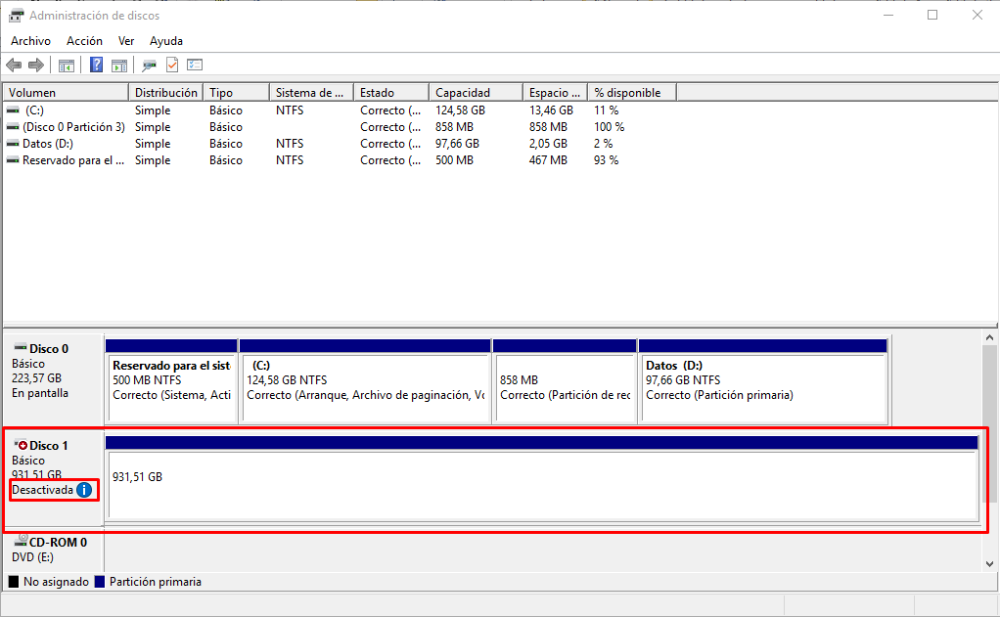

# Disco SAN

## SAN (Storage Area Network)
Ya conocemos los 3 modos de conexión del almacenamiento a los servidores. Estas 3 tecnologías son **DAS** (Direct Attached Storage), **NAS** (Network Attached Storage) y **SAN** (Storage Area Network). 

Tanto en DAS (Direct Attached Storage) como en SAN (Storage Area Network), las aplicaciones y programas de usuarios hacen sus peticiones de datos al sistema de ficheros directamente y éste accede al disco a nivel de bloques. En el lado opuesto se encuentra la tecnología NAS (Network-attached storage), donde las aplicaciones hacen las peticiones de datos a los sistemas de ficheros de **manera remota**.

Una red de área de almacenamiento, en inglés SAN (Storage Area Network), es una red concebida para conectar servidores, arrays de discos y librerías de soporte. Principalmente, está basada en tecnología fibre channel y más recientemente en iSCSI. Su función es la de conectar de manera rápida, segura y fiable los distintos elementos que la conforman. Una red SAN es utilizada para transportar datos entre servidores y recursos de almacenamiento. **El servidor accederá al dispositivo de almacenamiento mediante una conexión de red sin saber que está accediendo a un disco remoto.**

La tecnología SAN permite conectividad de alta velocidad, de servidor a almacenamiento, almacenamiento a almacenamiento, o servidor a servidor.

La principal diferencia entre una NAS y una SAN es que la SAN sirve los datos a bajo nivel a través de protocolos SCSI con tecnologías como fibre channel o iSCSI. Los equipos conectados a la SAN no solicitan los ficheros sino que como están conectados a bajo nivel solicitan el bloque concreto de un determinado disco. La máquina local conectada a una SAN verá el disco/compartición de la SAN como si fuera un disco/sistema de archivos local en lugar de uno remoto.

Para conectar el servidor y el medio de almacenamiento se utilizan normalmente 2 protocolos de red: iSCSI y Fibre Channel.
- **iSCSI**: (léase “iescasi”) es un estándar que permite el uso del protocolo SCSI sobre redes TCP/IP. Surgió para optimizar la velocidad de transferencia del flujo de datos través de la red. Este protocolo funciona directamente sobre TCP/IP aprovechando la infraestructura Ethernet existente, siempre que cumpla con unos requisitos de calidad. Desde el punto de vista de los drivers y las aplicaciones de software, los dispositivos parecen estar conectados realmente como dispositivos SCSI locales.
Al contrario que otros protocolos de red diseñados para almacenamiento, como por ejemplo el canal de fibra, solamente requiere una simple y sencilla interfaz Ethernet (o cualquier otra red compatible TCP/IP) para funcionar. Esto permite una solución de almacenamiento centralizada de bajo coste sin la necesidad de realizar inversiones costosas ni sufrir las habituales incompatibilidades asociadas a las soluciones canal de fibra para redes de área de almacenamiento.
- **FC (Fibre Channel o Canal de Fibra)**: Es una tecnología de red de alta velocidad que funciona bajo fibra óptica.

En un disco SAN necesitamos dos elementos, en el lado del servidor tendremos el Target iSCSI (el destino iSCSI), y en el lado del cliente tendremos el iniciador iSCSI. Esquemáticamente tenemos:

En esta práctica vamos a simular con la Raspberry Pi el lado servidor, para ello conectaremos un disco duro extraíble por el conector USB e instalaremos la aplicación del Target iSCSI.

Por otro lado, utilizaremos un equipo con Windows 10 como cliente, en el que haremos uso de la característica ya instalada de Iniciador iSCSI para acceder al disco conectado a la RPi como si de un disco local se tratara.

## Instalación del Target iSCSI
Partimos de una Raspberry Pi con el sistema operativo Raspbian instalado. Vamos a proceder a instalar el paquete para crear y administrar un Target iSCSI.

En primer lugar actualizamos los repositorios:

    $ sudo apt-get update

Instalamos el paquete llamado Target Framework (tgt):

    $ sudo apt-get install tgt

Para crear un Target iSCSI lo conveniente es trabajar con LUNs (Logical Unit Number) montados sobre volúmenes lógicos, en los que ampliar o reducir LUNs es muy sencillo y flexible. Por simplicidad, nosotros vamos a crear el Destino iSCSI directamente sobre el disco extraíble conectado a la RPi.

Conectamos el disco extraíble al puerto USB de la RPi. Comprobamos que Raspbian lo ha detectado (no lo ha montado). Ejecutamos el siguiente mandato:

    $ lsblk

Nos debe aparecer la siguiente información (o parecida):

    NAME        MAJ:MIN RM   SIZE RO TYPE MOUNTPOINT
    sda           8:0    0 931,5G  0 disk
    └─sda1        8:1    0 931,5G  0 part
    mmcblk0     179:0    0  14,5G  0 disk
    ├─mmcblk0p1 179:1    0   256M  0 part /boot
    └─mmcblk0p2 179:2    0  14,2G  0 part /

El dispositivo de disco *mmcblk0* es la tarjeta SD de la RPi (con 2 particiones como ya sabemos) y el dispositivo *sda* es el disco extraíble que en este caso tiene una única partición de 1TB (*sda1*).

Es por tanto el dispositivo *sda1* el que vamos a utilizar como disco en el Target iSCSI.

Para configurar el Target lo que vamos a hacer es modificar el archivo que contiene la configuración. Vamos a crearlo con el nombre que queramos, por ejemplo *asir99_iscsi* (donde el 99 es el número de la RPi que se te ha asignado) seguido de la extensión conf. Este archivo se ubica en */etc/tgt/conf.d/*

Lo editamos con el editor nano:

    $ sudo nano /etc/tgt/conf.d/asir99_iscsi.conf

Y ponemos el siguiente contenido:

    <target iqn.2020-02.es.iescamp:rpi99>
        backing-store /dev/sda1
    </target>

Este archivo admite muchos parámetros para toda la configuración del Target, pero por hacerlo más sencillo únicamente ponemos el nombre del destino (*iqn.2020-02.es.iescamp:rpi99*) y especificamos el dispositivo que estamos exportando (*/dev/sda1*).

Podemos poner el nombre del destino que queramos, pero debe ser un IQN (iSCSI Qualified Name) válido.

El IQN de un dispositivo iSCSI puede tener hasta 255 caracteres de longitud, con el siguiente formato:
    
    iqn.year-mo.reverse_domain_name:unique_name.

Donde:    
- year-mo representa el año y el mes en que se registró el dominio.
- reversed_domain_name es el nombre del dominio oficial, en orden inverso.
- unique_name es cualquier nombre que queramos utilizar. Suele utilizarse el hostname del servidor.

Un ejemplo de IQN sería:

    iqn.2020-01.com.dominio:Servidor01

Una vez guardado el archivo de configuración, reiniciamos el servicio:

    $ sudo service tgt restart

Podemos comprobar que todo ha ido bien y el target está disponible:

    $ sudo tgtadm --mode target --op show

    Target 1: iqn.2020-02.es.iescamp:rpi99
        System information:
            Driver: iscsi
            State: ready
        I_T nexus information:
        LUN information:
            LUN: 0
                Type: controller
                SCSI ID: IET     00010000
                SCSI SN: beaf10
                Size: 0 MB, Block size: 1
                Online: Yes
                Removable media: No
                Prevent removal: No
                Readonly: No
                SWP: No
                Thin-provisioning: No
                Backing store type: null
                Backing store path: None
                Backing store flags:
            LUN: 1
                Type: disk
                SCSI ID: IET     00010001
                SCSI SN: beaf11
                Size: 1000202 MB, Block size: 512
                Online: Yes
                Removable media: No
                Prevent removal: No
                Readonly: No
                SWP: No
                Thin-provisioning: No
                Backing store type: rdwr
                Backing store path: /dev/sda1
                Backing store flags:
        Account information:
        ACL information:
            ALL

Podemos comprobar el nombre iqn del target, el tamaño y el dispositivo de disco que hay detrás, así como que el estado es Ready.

## Configuración del Iniciador iSCSI En Windows
Para configurar la parte del cliente, Windows incorpora tanto en las versiones de escritorio como las server, una característica llamada Iniciador iSCSI. Se encuentra en Herramientas Administrativas.

Al ejecutarla por primera vez nos aparece un mensaje diciéndonos que el servicio correspondiente al iniciador iSCSI no está activado y si deseamos arrancarlo y dejarlo con inicio automático.

Podemos decirle que sí para que se inicie de manera automática, o decirle que no y activar manualmente el servicio si no queremos que se inicie cada vez que arranque el sistema. El servicio a arrancar es el siguiente:

En la ventana del iniciador iSCSI, en la pestaña de Destinos, ponemos la dirección IP donde se encuentra el Target iSCSI, es decir, la dirección IP de nuestra Raspberry y pulsamos sobre el botón de Conexión rápida…

Nos aparece una ventana con nuestro destino creado anteriormente. Aceptamos y nos aseguramos de que su estado es Conectado.

Ya tenemos el disco listo para ser utilizado en nuestro equipo Windows.

## Acceso al disco SAN

Antes de comenzar a utilizar el disco, vamos a ir al Administrador de Discos de Windows y comprobamos que lo tenemos conectado y en línea.

Si el disco apareciera Desactivado, deberemos ponerlo en línea con el menú contextual del ratón sobre el disco:

Una vez en línea, si el disco estuviera formateado con un sistema de ficheros reconocible por Windows (NTFS por ejemplo), ya podríamos utilizarlo sin ningún problema, asignándole automáticamente el sistema una letra de unidad.

Esta misma operación podríamos hacerla en varios iniciadores distintos, provocando que el disco esté conectado simultaneamente en varios equipos. Eso no es problema, iSCSI lo permite, pero no podrían hacerse operaciones de escritura simultáneas.
 
