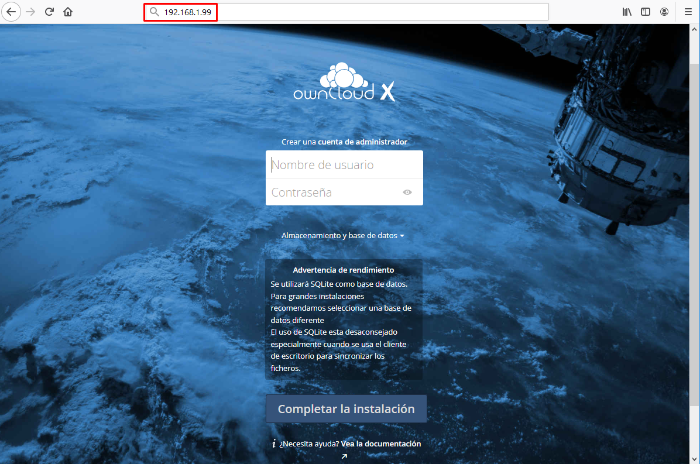

# NUBE PRIVADA CON OWNCLOUD

## ownCloud
ownCloud es una aplicación de software libre del tipo Servicio de alojamiento de archivos, que permite el almacenamiento en línea y aplicaciones en línea. Para hacernos una idea, nos permite tener nuestro propio servidor de almacenamiento online como si fueran los populares servicios Dropbox, Google Drive o OneDrive. La ventaja es que vamos a poder hacerlo en nuestro servidor local y sin límite de almacenamiento, y al ser software libre y gratuito, podemos instalarlo sin ningún coste.

Nosotros vamos a instalar este software en nuestra Raspberry Pi, haciendo ésta de servidor, y pudiendo acceder a ella mediante una página web, una aplicación de escritorio o una app de dispositivo móvil, tal y como hacen los populares servicios de Dropbox, etc.

La instalación es algo compleja, pues para funcionar este programa necesita que instalemos un servidor web (Apache en nuestro caso), un gestor de base de datos (MariaDB en nuestro caso) y puesto que el programa está escrito en el lenguaje PHP, necesitamos también instalar los paquetes necesarios de este lenguaje de servidor.

Además de instalar los paquetes, habrá que configurar el servidor web Apache y el gestor de BBDD MariaDB.

Por último, habrá que descargar el propio programa de ownCloud, descomprimirlo, moverlo al directorio web, asignarle permisos y por último ejecutar la última fase automática de la instalación.

Son unos cuantos pasos que, aunque no son complejos, pueden darnos algún problema y son un poco costosos.

En contraposición podemos optar por hacer una instalación mucho más sencilla que consistirá en ejecutar la aplicación en un contenedor que ya viene con el servidor web y el gestor de base de datos preinstalado y configurado correctamente. Lo único que habrá que hacer será la descarga y ejecución del contenedor con un único comando.

Vamos a ver las dos maneras de hacerlo y elegiremos una de ellas.

## Instalación clásica de ownCloud
Como hemos visto, el proceso de instalación de ownCloud en la raspberry es un tanto costoso, pues hay que instalar un Apache, PHP y MariaDB, además de la descarga e instalación del propio paquete de ownCloud.
Vayamos por pasos. En primer lugar actualizamos los repositorios:

    pi@raspberrypi:~ $ sudo apt update

Instalamos el servidor web Apache y el lenguaje PHP:

    pi@raspberrypi:~ $ sudo apt install php libapache2-mod-php apache2

Instalamos otros paquetes necesarios relacionados con PHP:

    pi@raspberrypi:~ $ sudo apt install php-mysql php-mbstring php-gettext php-intl php-redis php-imagick php-igbinary php-gmp php-curl php-gd php-zip php-imap php-ldap php-bz2 php-phpseclib

A continuación instalamos el gestor de base de datos MariaDB:

    pi@raspberrypi:~ $ sudo apt-get install mariadb-server

Configuramos el usuario y la contraseña del administrador de la BBDD, sustituyendo el nombre del usuario administrador y la contraseña password por lo que deseemos:

    pi@raspberrypi:~ $ sudo mysql
    MariaDB [(none)]>
    CREATE USER IF NOT EXISTS 'administrador'@'localhost' IDENTIFIED BY 'password';
    GRANT ALL PRIVILEGES ON *.* TO 'administrador'@'localhost' WITH GRANT OPTION;
    SHOW GRANTS FOR 'administrador'@'localhost' ;

    exit

Llega el momento de descargar el fichero *tar.bz2* con el programa ownCloud. Lo descargamos con el comando wget desde la página oficial:

    pi@raspberrypi:~ $ wget https://download.owncloud.org/community/owncloud-10.3.2.tar.bz2

Descomprimimos el fichero tar.bz2 descargado:

    pi@raspberrypi:~ $ tar -xvjf owncloud-10.3.2.tar.bz2

Copiamos el directorio descomprimido al directorio de datos donde tenemos el servidor web:

    pi@raspberrypi:~ $ sudo cp -r owncloud /var/www

Cambiamos la configuración para el sitio web que vamos a colgar en el servidor web. Para ello editamos un nuevo fichero llamado owncloud.conf:

    pi@raspberrypi:~ $ sudo nano /etc/apache2/sites-available/owncloud.conf

Y ponemos el siguiente contenido:

    Alias /owncloud "/var/www/owncloud/"

    <Directory /var/www/owncloud/>
    Options +FollowSymlinks
    AllowOverride All

    <IfModule mod_dav.c>
    Dav off
    </IfModule>

    SetEnv HOME /var/www/owncloud
    SetEnv HTTP_HOME /var/www/owncloud

    </Directory>

Creamos un enlace a ese fichero pero en otro directorio:

    pi@raspberrypi:~ $ sudo ln -s /etc/apache2/sites-available/owncloud.conf /etc/apache2/sites-enabled/owncloud.conf

Reiniciamos el servidor web Apache:

    pi@raspberrypi:~ $ sudo service apache2 restart

Y por último, cambiamos los permisos del directorio donde se almacenarán los datos subidos a ownCloud para que el usuario y el grupo propietario sea *www-data*, que será el usuario de Linux con el que interactuará el servidor web.

    pi@raspberrypi:~ $ sudo chown -R www-data:www-data /var/www/owncloud/

## Instalación de ownCloud mediante un contenedor
Ya hemos visto todos los pasos que necesitamos ejecutar para la instalación de ownCloud en nuestra Raspberry Pi. Vamos a ver otro método de instalación más sencillo y que consiste en la utilización de un contenedor Docker. Necesitamos, por tanto, tener Docker instalado y ejecutándose en nuestra Raspberry Pi.

El contenedor se llama *owncloud*. Este contenedor aún funciona, pero ha dejado de tener soporte y se ha creado en su lugar otro contenedor más actualizado, pero que para el propósito de este proyecto nos vale con el antiguo por su sencillez.

En primer lugar creamos el directorio donde almacenaremos los datos que suban a ownCloud los usuarios (por ejemplo a /srv/owncloud):

    pi@raspberrypi:~ $ sudo mkdir /srv/owncloud

Ejecutamos el contenedor sin necesidad de descargar la imagen. Docker lo hará por nosotros:

    pi@raspberrypi:~ $ docker run -d -p 80:80 -v /srv/owncloud:/var/www/html/data owncloud

Simplemente indicamos el puerto a redireccionar el servidor web en nuestra máquina (dejamos el 80) y montamos un volumen en el directorio que hemos creado */srv/owncloud* que se mapea en el directorio */var/www/html/data* del servidor web del contenedor.

## Acceso a ownCloud
Una vez instalada y puesta en marcha la aplicación, accedemos vía web a la Raspberry para finalizar la instalación. Dependiendo del método de instalación que hayamos elegido, el último paso de instalación será de una manera o de otra.

**Si hemos hecho la instalación normal:**

Accedemos mediante un navegador a la dirección IP de la Raspberry seguido del directorio */owncloud*
 
Nos pide un nombre de usuario para el administrador y una contraseña. Ponemos el que queramos.

En los campos de Usuario de la base de datos y Contraseña de la base de datos introducimos el usuario y contraseña que pusimos a la hora de configurar MariaDB. En el campo de Nombre de la base de datos tecleamos owncloud.

Por último pulsamos sobre el botón de Completar la Instalación.

**Si hemos optado por hacer una instalación en un contenedor:**

Accedemos vía web a la RPi y nos aparece una ventana como la siguiente:

Nos pide un nombre de usuario para el administrador y una contraseña. Ponemos el que queramos y pulsamos sobre Completar la instalación.

En ambos casos, pasados unos segundos, nos aparece la pantalla de login y ya estamos listos para iniciar sesión con el usuario administrador que acabamos de crear.

A partir de ese momento ya podemos acceder a administrar nuestros datos en la nube mediante un navegador web o mediante una app instalada en un dispositivo móvil conectado a nuestra red local (por ejemplo la app ocloud para Android).

