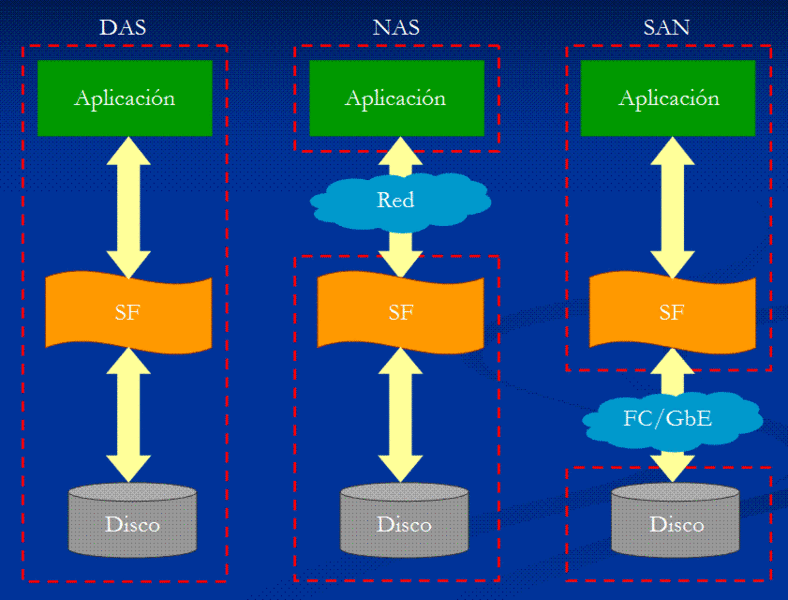
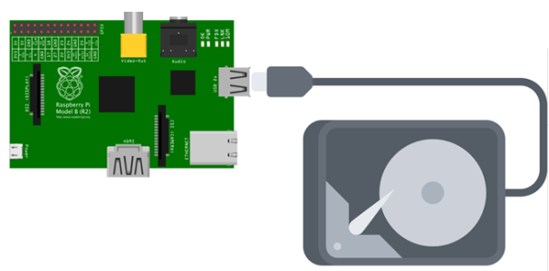

# DISCO DAS

Conexión de un disco DAS a nuestra Raspberry Pi

## DAS (Direct Attached Storage)
Ya conocemos los 3 modos de conexión del almacenamiento a los servidores. Estas 3 tecnologías son **DAS** (Direct Attached Storage), **NAS** (Network Attached Storage) y **SAN** (Storage Area Network). 

Tanto en DAS (Direct Attached Storage) como en SAN (Storage Area Network), las aplicaciones y programas de usuarios hacen sus peticiones de datos al sistema de ficheros directamente y éste accede al disco a nivel de bloques. En el lado opuesto se encuentra la tecnología NAS (Network-attached storage), donde las aplicaciones hacen las peticiones de datos a los sistemas de ficheros de **manera remota**.

DAS es el método tradicional de almacenamiento y el más sencillo. Consiste en conectar el dispositivo de almacenamiento directamente al servidor o estación de trabajo, es decir, físicamente conectado al dispositivo que hace uso de él. **El disco duro está conectado al servidor sin ningún dispositivo de red entre ellos**, normalmente mediante un Adaptador de Bus del Host (HBA).

Los protocolos usados habitualmente para la conexión de los discos DAS son los que hemos estudiado: SATA, SCSI, SAS y PCIe para discos NVMe.

El funcionamiento es el tradicional. La aplicación solicita un dato al Sistema de Ficheros (FS) del sistema operativo. El sistema de ficheros accede al disco mediante el protocolo correspondiente (SATA, SAS, …) y recupera los bloques necesarios del disco. Es el modelo que tienen todos los ordenadores domésticos y gran parte de los servidores pequeños o medianos.

## DAS en la Raspberry Pi
Sabemos que las Raspberry Pi utilizan una tarjeta Micro SD como disco duro. En este caso, la tarjeta SD es un Disco DAS, es decir, un disco conectado directamente al equipo.

Si sacamos un listado de los dispositivos de bloques (discos) que hay en el sistema, veremos que nos aparece nuestro disco (tarjeta SD) con sus particiones

    $ lsblk

    NAME        MAJ:MIN RM  SIZE RO TYPE MOUNTPOINT
    mmcblk0     179:0    0 14,5G  0 disk
    ├─mmcblk0p1 179:1    0  256M  0 part /boot
    └─mmcblk0p2 179:2    0 14,2G  0 part /

Al dispositivo lo ha llamado *mmcblk0*. Nos informa que tiene 14,5G (la tarjeta es de 16GB, pero ya sabemos la diferencia entre los gigabytes y los gibibytes), y que hay 2 particiones:
- Una partición de 256MB de arranque montada en /boot
- Una partición principal de 14,2GB montada en /

Por tratarse de un disco SD, a diferencia de lo que suele pasar con los disco SATA, la nomenclatura del disco no es */dev/sda*, sino */dev/mmcblk0*.

Podemos ver la información de las particiones de forma más detallada utilizando el mandato *fdisk*:

    $ sudo fdisk -l /dev/mmcblk0

    Disk /dev/mmcblk0: 14,5 GiB, 15510536192 bytes, 30294016 sectors
    Units: sectors of 1 * 512 = 512 bytes
    Sector size (logical/physical): 512 bytes / 512 bytes
    I/O size (minimum/optimal): 512 bytes / 512 bytes
    Disklabel type: dos
    Disk identifier: 0x738a4d67

    Device         Boot  Start      End  Sectors  Size Id Type
    /dev/mmcblk0p1        8192   532479   524288  256M  c W95 FAT32 (LBA)
    /dev/mmcblk0p2      532480 30294015 29761536 14,2G 83 Linux

Nos informa de lo mismo que el mandato *lsblk*, pero podemos ver el tamaño y el tipo de cada partición, así como el tipo de tabla de partición.

A excepción del nombre, Raspbian trata la tarjeta SD como un disco cualquiera.

Obviamente es un disco DAS (conectado directamente al sistema).

## Conexión de un segundo disco DAS
Vamos a conectar un disco duro extraíble directamente a la Raspberry, como se hace con cualquier disco extraíble en cualquier equipo.

Sigue siendo un disco DAS aunque sea un disco externo, pues está conectado directamente al equipo.

Procedemos a conectar el disco externo a un puerto USB, preferiblemente en uno de los puertos USB 3, pero si nos da problemas de reconocimiento, no tendremos más remedio que ponerlo en el USB 2.
Raspbian lo reconocerá automáticamente. Ejecutamos *lsblk*:

    $ lsblk

    NAME        MAJ:MIN RM   SIZE RO TYPE MOUNTPOINT
    sda           8:0    0 931,5G  0 disk
    └─sda1        8:1    0 931,5G  0 part
    mmcblk0     179:0    0  14,5G  0 disk
    ├─mmcblk0p1 179:1    0   256M  0 part /boot
    └─mmcblk0p2 179:2    0  14,2G  0 part /

Observamos que el disco */dev/sda* no está montado de manera automática. Tendremos que montarlo.

Ejecutamos *fdisk* y comprobamos las particiones:

    $ sudo fdisk –l /dev/sda

    Disk model: 2115
    Units: sectors of 1 * 512 = 512 bytes
    Sector size (logical/physical): 512 bytes / 512 bytes
    I/O size (minimum/optimal): 512 bytes / 512 bytes
    Disklabel type: dos
    Disk identifier: 0x6074e905

    Device     Boot Start        End    Sectors   Size Id Type
    /dev/sda1        2048 1953521663 1953519616 931,5G  7 HPFS/NTFS/exFAT

En este caso hay un disco */dev/sda* de 1TB (931GB) con una única partición que ocupa todo el disco y formateada en NTFS.

Vamos a montarlo. En primer lugar creamos un directorio en */media* llamado *disco_ext* donde montaremos el disco:

    $ sudo mkdir /media/disco_ext

Procedemos al montaje indicando la partición que queremos montar y el directorio donde será montado:

    $ sudo mount /dev/sda1 /media/disco_ext

Y ya está listo para ser utilizado. Habrá que tener ojo con los permisos, puesto que los mandatos los hemos hecho con el sudo, y por consiguiente el propietario del directorio será root.

Para desmontar el disco, estando en una localización fuera del mismo, tecleamos:

    $ sudo umount /dev/sda1
