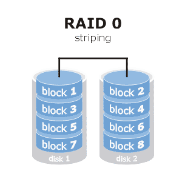

# RAID

## RAID-0
Existen diversas manera de prevenir pérdidas de datos en los sistemas de almacenamiento mediante sistemas tolerantes a fallos, así, si se produce un error en el disco, el sistema es capaz de continuar trabajando sin que se resienta y sin producir pérdidas de información.

En los sistemas de almacenamiento, normalmente, cuando hablamos de tolerancia a fallos nos referimos al término RAID.

**RAID** (Redundant Array of Independent Disks, conjunto redundante de discos independientes), es un sistema de almacenamiento que usa múltiples discos duros para almacenar los datos. Dentro de RAID existen varios niveles, los cuales implementan soluciones distintas para mantener la integridad, la tolerancia a fallos o incluso la rapidez en el acceso a la información. Dependiendo del nivel elegido, los beneficios en una u otra área serán más o menos altos.

Los discos duros están conectados entre sí por medio de controladoras, o bien por medio de software o bien por una mezcla de ambos, de manera que cuando una unidad física de disco falle o se venga abajo, los datos de esa unidad no se pierden, se pueden recuperar reconstruyendo la información. Esto también se puede hacer desde el sistema operativo, mediante software especial o accediendo al arrancar el equipo al programa de la controladora de discos duros.

Los sistemas redundantes RAID por software presentan un rendimiento inferior a los sistemas RAID implementados directamente por hardware mediante controladoras específicas. En este último caso el sistema operativo no se entera de que se está utilizando un sistema RAID, pues de toda la gestión se encarga la controladora específica del disco duro.

Las configuraciones de RAID más conocidas y utilizadas son el RAID-0, RAID-1 y RAID-5, pero no son las únicas. En esta práctica nos vamos a centrar en **RAID-0**.

El RAID-0 se le conoce también como volumen distribuido o bandas de datos (data striping). Se forma uniendo 2 discos, y el volumen resultante tiene como tamaño la suma de los tamaños de los 2 discos originales. La información a almacenar se distribuirá por los 2 discos a partes iguales de manera que se utilizan los 2 discos por igual, mejorando de esta manera el rendimiento pero no respetando la integridad de los datos, de manera que si uno de los 2 discos falla, todo el volumen se viene abajo, implicando la pérdida total de los datos.

**Ventajas:** Proporciona alto rendimiento, tiempos de acceso muy bajos y posibilidad de acceso en paralelo (puesto que se lee y escribe en los dos discos al mismo tiempo). No tiene coste adicional. Se emplea toda la capacidad de los 2 discos.

**Inconvenientes:** No es verdaderamente un disco RAID ya que no presenta integridad de los datos. Un error en uno de los discos implica la pérdida total de los datos.

Para la realización de esta práctica sería deseable poder ver los RAIDs con discos duros extraíbles conectados a la Raspberry Pi. Esto implica una serie de inconvenientes. El primero es que necesitamos formatear los discos, borrando todo aquello que pudieran contener. El segundo inconveniente es que necesitamos que los discos sean iguales. Y el principal inconveniente viene por las propias limitaciones de la Raspberry Pi. Los discos duros extraíbles se alimentan por el conector USB. La potencia necesaria varía de unos modelos de discos a otros, y también dependen de si el disco está en reposo o está haciendo operaciones de lectura y/o escritura. Si los discos no tienen alimentación externa y conectamos 2 discos a los puertos USB de la Raspberry Pi, es probable que nuestra Raspberry no tenga potencia suficiente (incluso alimentándola con un cargador de 3 A) para sostener a los 2 discos. El límite es de 1,2 A en los puertos USB, lo cual puede ser suficiente para un disco, pero no para dos.

Por todo ello, vamos a hacer esta práctica con tarjetas SD a modo de disco duro. Si la hacemos por grupos de 3 alumnos podemos utilizar una Raspberry Pi donde trabajar, y las tarjetas SD de los otros 2 alumnos como Discos Duros. En este caso necesitaremos adaptadores microSD-USB para poder conectar las tarjetas microSD a los puertos USB.

**ATENCIÓN:** El contenido de las tarjetas será eliminado.

## CONEXIÓN DEL PRIMER DISCO EXTRAÍBLE
### Conexión y montaje del disco
Al igual que hicimos con la conexión de un disco DAS, vamos a conectar un disco duro extraíble directamente a la Raspberry.
Lo conectamos a un puerto USB preferiblemente en uno de los puertos USB 3.

Raspbian lo reconocerá automáticamente. Ejecutamos *lsblk*:

    $ lsblk

    NAME        MAJ:MIN RM   SIZE RO TYPE MOUNTPOINT
    sda           8:0    1 14.5G  0 disk
    └─sda1        8:1    1 14.5G  0 part
    mmcblk0     179:0    0  14,5G  0 disk
    ├─mmcblk0p1 179:1    0   256M  0 part /boot
    └─mmcblk0p2 179:2    0  14,2G  0 part /

Observamos que el disco */dev/sda* no está montado de manera automática. Tendremos que montarlo.

Ejecutamos *fdisk* y comprobamos las particiones:

    $ sudo fdisk –l /dev/sda

    Disk /dev/sda: 14.5 GiB, 15510536192 bytes, 30294016 sectors
    Disk model:
    Units: sectors of 1 * 512 = 512 bytes
    Sector size (logical/physical): 512 bytes / 512 bytes
    I/O size (minimum/optimal): 512 bytes / 512 bytes
    Disklabel type: dos
    Disk identifier: 0x62175270

    Device     Boot Start      End  Sectors  Size Id Type
    /dev/sda1        8192 30294015 30285824 14.5G  c W95 FAT32 (LBA)

En este caso hay un disco */dev/sda* de 15.5 GiB (16GB) con una única partición que ocupa todo el disco y formateada en FAT32. Si el disco no estuviera formateado, habría que hacerlo con el mandato *mkfs*:

    $ sudo mkfs /dev/sda1

Vamos a medir la velocidad de escritura. Para ello es necesario montar el disco. En primer lugar creamos un directorio en /media llamado *disco_ext* donde montaremos el disco:

    $ sudo mkdir /media/disco_ext

Procedemos al montaje indicando la partición que queremos montar y el directorio donde será montado:

    $ sudo mount /dev/sda1 /media/disco_ext

### Prueba de la velocidad de escritura
Una vez está montado el disco en un directorio del sistema de ficheros ya podríamos comenzar a trabajar con él. Lo único que vamos a hacer nosotros en escribir un fichero y comprobar la velocidad de escritura.

Para hacer esto vamos a ejecutar el comando *dd*. Este comando es una potente instrucción que nos permite copiar archivos, particiones e incluso discos enteros. Se le ha de especificar el fichero (o dispositivo) de entrada (input file, *if*) y el fichero (o dispositivo) de salida (output file, *of*). 

En nuestro caso el archivo de entrada (*if*) es un archivo especial llamado */dev/zero* que se utiliza para rellenar con caracteres *null* el archivo de salida. El archivo de salida será un nuevo archivo llamado *test* que se creará en el dispositivo montado.

Además, le especificamos el tamaño de bloque a copiar (64KB cada bloque) y la cantidad de bloques (16KB). Por tanto, el archivo resultante tendrá un tamaño de 64KB x 16KB = 1GB.

    $ sudo dd if=/dev/zero of=/media/disco_ext/test bs=64k count=16k conv=fdatasync
    Resultado:
    16384+0 records in
    16384+0 records out
    1073741824 bytes (1.1 GB, 1.0 GiB) copied, 78.4359 s, 13.7 MB/s

Borramos el archivo creado, pues ya no lo necesitamos y ocupa 1GB (realmente no hace falta borrarlo, pues después vamos a formatear el disco y se va a perder toda la información que haya).

    $ sudo rm /media/disco_ext/test

### Desmontaje
Una vez medida la velocidad de escritura procedemos a desmontar el disco. Para desmontar el disco, estando en una localización fuera del mismo, tecleamos:

    $ sudo umount /dev/sda1

## CONEXIÓN DEL SEGUNDO DISCO EXTRAÍBLE
Conectamos el segundo disco, también a un puerto USB 3. Raspbian lo reconocerá automáticamente. Ejecutamos *lsblk*:

    $ lsblk

    NAME        MAJ:MIN RM   SIZE RO TYPE MOUNTPOINT
    sda           8:0    1 14.5G  0 disk
    └─sda1        8:1    1 14.5G  0 part
    sdb           8:16   1 14.5G  0 disk
    └─sdb1        8:17   1 14.5G  0 part
    mmcblk0     179:0    0 14.5G  0 disk
    ├─mmcblk0p1 179:1    0  256M  0 part  /boot
    └─mmcblk0p2 179:2    0 14.2G  0 part  /

Tenemos los 2 discos conectados como */dev/sda* y */dev/sdb*, y las particiones NTFS que hay creadas en cada uno de esos discos son */dev/sda1* y */dev/sdb1*.

## INSTALACIÓN DE MDADM
Vamos a proceder a instalar el paquete *MDADM* (Multiple Device Administrator), que es un conjunto de herramientas que son utilizadas en GNU/Linux para la gestión del RAID.

MDADM viene instalado en algunas distribuciones Linux por defecto (en las Servers normalmente) pero no en Raspbian.

En primer lugar actualizamos los repositorios:

    $ sudo apt-get update

Instalamos el paquete llamado mdam:

    $ sudo apt-get install mdadm

## CREACIÓN DEL RAID 0
Una vez instalado el paquete mdadm ya podemos podemos crear los siguientes tipos de RAID: RAID 0, RAID 1, RAID 4, RAID 5, RAID 6 y RAID 10.

Vamos a crear un RAID-0 con los dos discos definidos como dispositivos */dev/sda* y */dev/sdb*.

Con el siguiente comando creamos un RAID-0 en un nuevo dispositivo de disco (*/dev/md0*), indicando el número de dispositivos que lo integrarán (*raid-devices=2*) y las unidades de almacenamiento que lo integrarán (*/dev/sda* y */dev/sdb*).

**OJO**. Si alguno de los 2 discos tuviera alguna tabla de partición, el sistema nos avisa de que será eliminada, y por tanto las particiones existentes se borrarán, y con ellas todos los datos.

    $ sudo mdadm --create /dev/md0 --level=0 --raid-devices=2 /dev/sda /dev/sdb

Si nos aparece alguna advertencia, la podemos pasar por alto pulsando *y*.

El RAID comienza a construirse. Se puede ver el estado de progreso ejecutando lo siguiente:

    $ sudo mdadm --detail /dev/md0

Cuando haya finalizado (dependiendo del tamaño de los discos puede tardar unos minutos), en el estado (state) aparecerá active o clean. En *Rsync Status* aparece el progreso.

##CREACIÓN DEL SISTEMA DE ARCHIVOS Y MONTAJE
Una vez creado el conjunto RAID se nos crea un nuevo dispositivo con el nombre que le hemos dado (/dev/md0).

Para poder trabajar con el nuevo dispositivo */dev/md0* debemos crear un sistema de archivos ext4 en el mismo:

    $ sudo mkfs /dev/md0

Este es un proceso costoso que también puede tardar unos minutos dependiendo del tamaño de los discos.
Una vez creado el sistema de archivos, procedemos al montaje.

Vamos a utilizar el mismo directorio que hemos creado antes (*/media/disco_ext*) para el montaje del primer disco. En este caso ya montamos el nuevo dispositivo /dev/md0. Utilizamos el comando *mount*.

    $ sudo mount /dev/md0 /media/disco_ext

Cambiamos el usuario propietario y el grupo propietario del directorio que acabamos de crear para que en lugar de ser *root* sea nuestro usuario (*pi*). Esto nos facilitará la gestión de permisos y el poder escribir en el disco una vez montado.

    $ sudo chown pi:pi /media/disco_ext/ -R

## COMPROBACIÓN DEL FUNCIONAMIENTO
Finalizado el proceso de creación, comprobamos con el mandato *lsblk* la lista de dispositivos:

    $ lsblk
    NAME        MAJ:MIN RM  SIZE RO TYPE  MOUNTPOINT
    sda           8:0    1 14.5G  0 disk
    ├─sda1        8:1    1 14.5G  0 part
    └─md0         9:0    0 28.9G  0 raid0 /media/disco_ext
    sdb           8:16   1 14.5G  0 disk
    ├─sdb1        8:17   1 14.5G  0 part
    └─md0         9:0    0 28.9G  0 raid0 /media/disco_ext
    mmcblk0     179:0    0 14.5G  0 disk
    ├─mmcblk0p1 179:1    0  256M  0 part  /boot
    └─mmcblk0p2 179:2    0 14.2G  0 part  /

Observamos que el dispositivo */dev/md0* aparece repetido. Esto es así porque depende de los dos dispositivos de disco */dev/sda* y */dev/sdb*. Nos fijamos también que el tamaño del nuevo disco es la suma de los tamaños de los 2 discos originales.

Vamos a repetir la prueba de escritura, esta vez sobre el nuevo dispositivo */dev/md0*. Al ser un RAID 0, el tamaño final del nuevo volumen es (como acabamos de comprobar) la suma de los 2 dispositivos de discos que lo forman. RAID 0 no nos proporciona ninguna tolerancia frente a fallos, de manera que un error en cualquiera de los 2 discos que lo forman implicaría la pérdida de todos los datos que hubieran almacenados en el dispositivo completo. En cambio, RAID 0 nos proporciona mejor rendimiento de lectura y escritura pues accede al mismo tiempo a los 2 discos, repartiendo los datos entre ambos y pudiendo hacerlo en paralelo. Por tanto, al repetir la prueba de escritura de 1 GB el tiempo que tarde en escribir va a ser bastante menor que los mostrados al principio.

    $ dd if=/dev/zero of=/media/disco_ext/test bs=64k count=16k conv=fdatasync
    16384+0 records in
    16384+0 records out
    1073741824 bytes (1.1 GB, 1.0 GiB) copied, 45.0553 s, 21.5 MB/s

