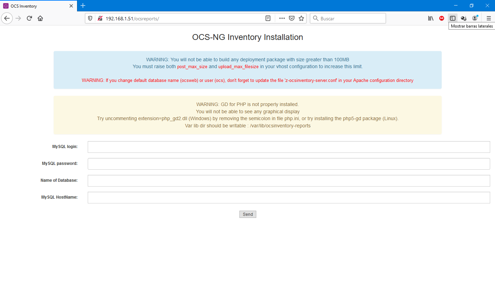
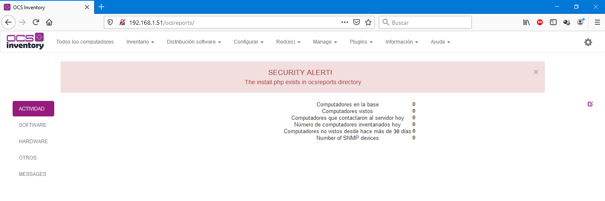
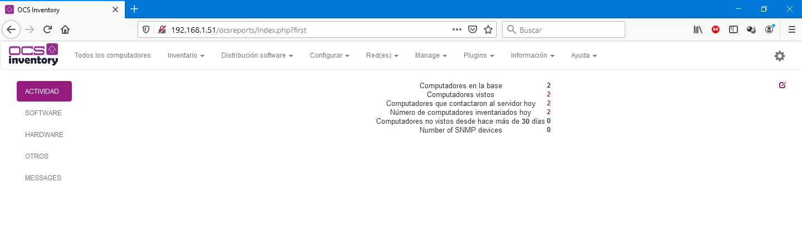
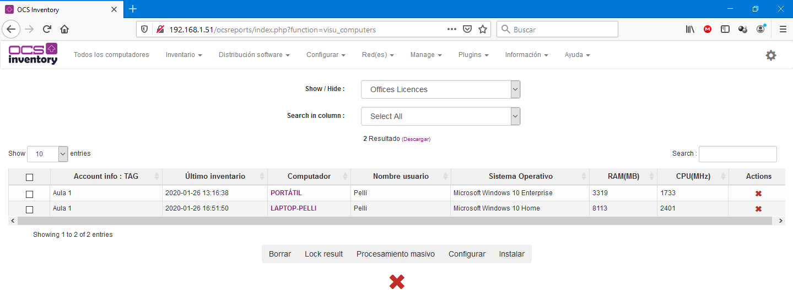

# OCS Inventory

## OCS Inventory
OCS Inventory es una aplicación de software libre que nos va a permitir tener un inventario siempre actualizado de todos los activos TIC. OCS recopila información de manera automática sobre el hardware y software de equipos que hay en la red que ejecutan el programa cliente (el agente OCS). OCS nos permite visualizar el inventario a través de una interfaz web. Además, tiene muchas opciones más como escanear la red por medio del IPDiscovery, o instalar aplicaciones remotamente creando Builds.

Nosotros vamos a instalar este software en nuestra Raspberry Pi, haciendo ésta de servidor, y pudiendo acceder a ella mediante una página web para consultar el inventario. Los equipos clientes ejecutarán el agente. El agente se puede dejar instalado para que se ejecute como un servicio de manera periódica y automática en los clientes, pero nosotros haremos una ejecución manual en algún equipo con Windows 10.

La instalación del servidor es algo compleja, pues para funcionar este programa necesita que instalemos un servidor web (Apache en nuestro caso), un gestor de base de datos (MariaDB en nuestro caso) y muchas librerías y paquetes de PERL en nuestra RPi.

Además de instalar los paquetes, habrá que configurar el servidor web Apache y el gestor de BBDD MariaDB.
Por último, habrá que descargar el propio programa OCS Inventory, descomprimirlo y configurarlo.
Son unos cuantos pasos que, aunque no son difíciles de entender, pueden darnos algún problema y son un poco costosos.

## INSTALACIÓN DEL SERVIDOR OCS INVENTORY EN LA RPi
Como se ha comentado, el proceso de instalación de OCS Inventory en la raspberry es un tanto costoso, pues hay que instalar un Apache, PERL y MariaDB, además de la descarga e instalación del propio paquete.

Vayamos por pasos. En primer lugar actualizamos los repositorios:

    pi@raspberrypi:~ $ sudo apt-get update

Instalamos el servidor web Apache, el lenguaje PHP y otros paquetes necesarios:

    pi@raspberrypi:~ $ sudo apt install apache2 libapache2-mod-perl2 php php-curl php-mbstring php-soap php-xml php-pclzip php-mysql php-zip php-gd make build-essential

    pi@raspberrypi:~ $ sudo apt install libxml-simple-perl libperl5.28 libdbi-perl libdbd-mysql-perl libapache-dbi-perl libnet-ip-perl libsoap-lite-perl libarchive-zip-perl libyaml-perl

Instalamos otros paquetes necesarios relacionados con Perl (proceso costoso):

    pi@raspberrypi:~ $ sudo cpan -i XML::Entities Compress::Zlib Archive::Zip Mojolicious::Lite Switch Plack::Handler

A continuación instalamos el gestor de base de datos MariaDB:

    pi@raspberrypi:~ $ sudo apt-get install mariadb-server

Configuramos el usuario y la contraseña del administrador de la BBDD:

    pi@raspberrypi:~ $ sudo mysql

    MariaDB [(none)]>
    CREATE USER IF NOT EXISTS 'ocsuser'@'localhost' IDENTIFIED BY 'ocspassword';
    CREATE DATABASE ocsweb
    DEFAULT CHARACTER SET utf8
    DEFAULT COLLATE utf8_general_ci;
    GRANT ALL PRIVILEGES ON *.* TO 'ocsuser'@'localhost' WITH GRANT OPTION;
    SHOW GRANTS FOR 'ocsuser'@'localhost' ;

    exit

Llega el momento de descargar el fichero *tar.bz2* con el programa OCS Inventory. Lo descargamos con el comando *wget* desde el repositorio de Git Hub:

    pi@raspberrypi:~ $ sudo wget https://github.com/OCSInventory-NG/OCSInventory-ocsreports/releases/download/2.5/OCSNG_UNIX_SERVER_2.5.tar.gz

Descomprimimos el fichero *tar.bz2* descargado:

    pi@raspberrypi:~ $ sudo tar -zxvf OCSNG_UNIX_SERVER_2.5.tar.gz

Ejecutamos el script de instalación:

    pi@raspberrypi:~ $  cd OCSNG_UNIX_SERVER_2.5/
    pi@raspberrypi:~ $  sudo ./setup.sh

Creamos un enlace a al fichero de configuración del sitio web en al que entraremos para ver los informes pero en otra ubicación:

    pi@raspberrypi:~ $ sudo ln -s /etc/apache2/conf-available/ocsinventory-reports.conf /etc/apache2/sites-enabled/ocsinventory-reports.conf

Repetimos la operación pero para el sitio donde se almacenarán los datos por parte del agente:

    pi@raspberrypi:~ $ sudo ln -s /etc/apache2/conf-available/z-ocsinventory-server.conf /etc/apache2/sites-enabled/z-ocsinventory-server.conf

Reiniciamos el servidor web Apache:

    pi@raspberrypi:~ $ sudo service apache2 restart

## FINALIZACIÓN DE LA INSTALACIÓN VÍA WEB
Ya tenemos instalado el servidor, vamos a acabar de configurar el sitio web. Para ello, desde un ordenador con acceso a la red de nuestra Raspberry abrimos el navegador y accedemos a la dirección de la RPi:

    http://DireccionDelServer/ocsreports

Nos avisa de unos warnings. El primero tiene que ver con el tamaño máximo de ficheros a subir a la web (100MB). Se soluciona (no lo vamos a hacer) modificando el archivo */etc/apache2/conf-available/ocsinventory-reports.conf*

El segundo warning está ralacionado con los permisos de escritura en la carpeta /var/lib/ocsinventory-reports. Para eliminar esta advertencia tecleamos:

    pi@raspberrypi:~ $ sudo chown www-data:www-data -R /var/lib/ocsinventory-reports

Rellenamos los campos que nos solicita con los parámetros que pusimos al crear la base de datos:
- MySQL login: **ocsuser**
- MySQL password: **ocspassword**
- Name of Database: **ocsweb**
- Dejamos en blanco el nombre del servidor MySQL.

Se completa la instalación.

Seleccionamos el idioma español y nos validamos con el usuario y contraseña que se crea por defecto:
- Usuario: **admin**
- Contraseña: **admin**

Una vez validados, vemos que nos da una alerta de que existe el fichero de instalación en el directorio web y puesto que ya no se va a utilizar, nos sugiere eliminarlo.

Para eliminar (renombrar) el fichero podemos ejecutar el siguiente mandato en el servidor:

    pi@raspberrypi:~ $ sudo mv /usr/share/ocsinventory-reports/ocsreports/install.php /usr/share/ocsinventory-reports/ocsreports/install.php_old

Y por último modificamos el fichero de configuración para que los inventarios se puedan subir de manera automática:

    pi@raspberrypi:~ $ sudo nano /etc/apache2/conf-available/z-ocsinventory-server.conf

Modificamos el fichero para poner el usuario y contraseña que especificamos al crear la base de datos. Se encuentran en las líneas donde aparece **OCS_DB_USER** y **OCS_DB:PWD**:

    # Which version of mod_perl we are using
    # For mod_perl <= 1.999_21, replace 2 by 1 # For mod_perl > 1.999_21, replace 2 by 2
    PerlSetEnv OCS_MODPERL_VERSION 2

    # Master Database settings
    # Replace localhost by hostname or ip of MySQL server for WRITE
    PerlSetEnv OCS_DB_HOST localhost
    # Replace 3306 by port where running MySQL server, generally 3306
    PerlSetEnv OCS_DB_PORT 3306
    # Name of database
    PerlSetEnv OCS_DB_NAME ocsweb
    PerlSetEnv OCS_DB_LOCAL ocsweb
    # User allowed to connect to database
    PerlSetEnv OCS_DB_USER ocsuser
    # Password for user
    PerlSetVar OCS_DB_PWD ocspassword

Reiniciamos el servidor web:

    pi@raspberrypi:~ $ sudo service apache2 restart

## INSTALACIÓN DEL AGENTE EN LOS CLIENTES
Para enviar de manera automática el inventario de un equipo a nuestro recién instalado servidor debemos ejecutar en el equipo cliente un agente. Dependiendo del sistema operativo instalado debemos descargar desde la página web oficial uno de los programas clientes válidos para nuestro cliente.

Nosotros vamos a enviar el inventario desde una máquina **Windows 10**, pero en lugar de descargar e instalar el programa agente para que se ejecute de manera automática y periódica, vamos a descargar un script que he hecho para que sólo se envíe una vez el inventario sin necesidad de instalar ningún programa en nuestro equipo.

Es un script muy sencillo que llama al programa que envía el inventario pasándole como parámetro la dirección IP de nuestra raspberry que nos solicitará por pantalla.

Descargamos el siguiente archivo zip en una máquina Windows 10 (pulsar en *Guardar enlace como*):

[Cliente OCSInventory](../ocsinventory/OCSInventory.zip)

Descomprimimos el archivo .zip y ejecutamos el script *.\inventario.ps1* (pulsamos con el botón derecho del ratón y seleccionamos la opción Ejecutar con PowerShell).

Nos solicita la IP de la Raspberry y se envía el inventario.

## ACCESO A LOS INFORMES
OCS Inventory nos proporciona mediante su interfaz web un informe dinámico con todo el Hardware y Software de los equipos inventariados.

Para acceder a los resultados basta con validarnos en la dirección web del servidor (nuestra raspberry) con el usuario admin y la contraseña admin.

Una vez hemos entrado podemos cambiar la contraseña del usuario admin y acceder a todos los informes de los equipos que han enviado información desde el agente al servidor OCS.

