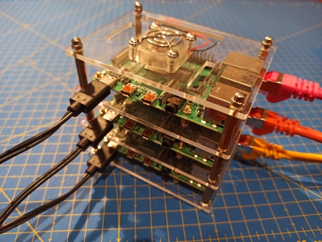

# CLUSTER DE DOCKER SWARM

Esta práctica consiste en la creación de un Cluster de Raspberrys con el fin de ejecutar contenedores en el mismo. El hecho de utilizar un cluster nos va a proporcionar ventajas como **Alta Disponibilidad** o **Escalabilidad** en nuestro sistema, de modo que el servicio que estemos ejecutando en un contenedor esté siempre disponible aunque caiga alguno de los nodos del cluster, y que además sea sencillo de escalar (ampliar) la capacidad de respuesta del servicio para satisfacer necesidades.

Para poder crear un cluster necesitaremos de varias Raspberrys, por tanto esta práctica debe hacerse por grupos (3 es un número ideal) compartiendo las Raspberrys. Los ejemplos que se detallan a continuación son para un cluster formado por 3 RPi, 1 de ellas actuando como servidor maestro (*manager* en el argot de Docker Swarm) y las otras 2 como esclavos (*workers* en Docker Swarm).

## DOCKER SWARM
**Docker Swarm** es un componente de Docker que se instala automáticamente al instalar Docker Engine, por lo tanto no debemos hacer nada especial para su instalación, más allá de la instalación de Docker.

Docker Swarm es un Orquestador de Contenedores. Como se puede intuir a partir de su nombre, un orquestador de contenedores nos ayuda con la implementación, escalado y administración de aplicaciones en contenedores. Nos permite administrar clusters donde ejecutar contenedores, proporcionando alta disponibilidad, escalado, balanceo de carga, monitorización, etc. De entre los orquestadores de contenedores, el más famoso y utilizado es **Kubernetes**, un software de código abierto que comenzó a desarrollar Google para la orquestación de los contenedores en su infraestructura.

### Alta Disponibilidad
Una solución de Alta Disponibilidad es aquella que nos permite que el sistema informático esté disponible las 24 horas del día de los 365 días del año. Existen muchas opciones de alta disponibilidad dependiendo de qué componente (hardware o software) deseamos que esté siempre disponible. Una de ellas es la replicación de los servicios o aplicaciones en varias máquinas redundantes, de modo que si una de las máquinas cae, la otra estará disponible para levantar inmediatamente el servicio caído.

En esta práctica, aprovechando la creación de un cluster, crearemos un servicio de alta disponibilidad de modo que si un nodo *worker* de nuestro cluster cae, automáticamente el servicio se ejecute en otro de los nodos *workers*. El problema vendría cuando el que cae es el nodo maestro (*manager*) que gestiona la replicación. Docker Swarm también permite la disponibilidad de nodos *manager* mediante otros mecanismos.

### Escalado
Cuando decimos que una solución informática (o un equipo, un servidor o lo que sea) es escalable, hacemos referencia a la capacidad que tiene de crecer (o de decrecer) para adaptarse a la carga de trabajo de un momento determinado. Es decir, se refiere a la capacidad de crecimiento de la aplicación para atender a un número cada vez mayor de solicitudes y usuarios con total normalidad y sin degradaciones de servicio.

Si montamos un servidor web que recibe pocas peticiones, basta con una pequeña máquina que vaya sirviendo esas solicitudes. Pero si el número de solicitudes empieza a crecer, es posible que esa pequeña máquina no pueda atenderlas todas, produciendo un retraso y una degradación del servicio, incluso un colapso de la máquina.

Para evitar esto se recurre al escalado. Hay 2 tipos de escalado:
- **Escalado Vertical:** Consiste en hacer “más grande” esa pequeña máquina. Se consigue ampliando el hardware (más procesador, más memoria, discos más rápidos, nuevas versiones de hardware más rápidas, etc).
- **Escalado Horizontal:** En este caso lo que hacemos es ampliar el número de máquinas (o de nodos de un cluster, o de contenedores en ejecución, …) que proporcionan el servicio que está siendo accedido.

El escalado vertical lo conseguimos ampliando el hardware del servidor físico o bien ampliando la máquina virtual que aloje nuestro servicio, siempre y cuando haya recursos disponibles. En cualquier caso lleva asociado, normalmente, un tiempo de actualización en el que es necesario apagar el servidor.

El escalado horizontal, en cambio, puede llegar a ser inmediato siempre que tengamos recursos disponibles en nuestro cluster, permitiendo tener servicios de autoescalado que nos permitan crecer (o decrecer) en base a la carga de trabajo puntual de nuestra aplicación o servicio.

Docker Swarm permite de manera muy sencilla el escalado del número de contenedores ejecutándose en nuestro cluster, permitiendo una rápida ampliación del servicio en caso de que fuera necesario.

En esta práctica el escalado lo haremos de forma manual, pero sería posible utilizar aplicaciones de autoescalado en base al monitoreo de los servidores, tal y como se hace en las aplicaciones de cloud computing.

## PREPARACIÓN DE LAS MÁQUINAS
### Montaje del Cluster
Vamos a montar un cluster con 3 Raspberry Pi. Para montar un cluster de Docker Swarm en las Raspberry Pi no es necesario hacer nada especial, más allá de que todas las Raspberrys estén en la misma red, con nombres de máquina y direcciones IP distintas, y con Docker instalado en todas ellas.

Para hacer más vistoso nuestro cluster y dar más sensación de veracidad, podemos optar por montar las Raspberrys Pi en un Pi Rack y conectarlas a la red mediante cableado y un switch.

### Preparación de las máquinas
Arrancamos las 3 Raspberry Pi y nos conectamos a ellas mediante ssh. Una de las Raspberry Pi la elegiremos como nodo maestro.
En primer lugar vamos a nombrar cada nodo con un nombre único. Podemos utilizar como nombres Maestro, Nodo1 y Nodo2. Si los nombres ya existieran en la red (de otros compañeros) utilizaremos otra combinación.

Tenemos 2 opciones para cambiar el nombre de las máquinas. La primera opción es utilizar la utilidad de configuración de Raspbian (entrando en la opción Network Options y cambiando el Hostname):

    $ sudo raspi-config

La segunda opción es optar por cambiar directamente el nombre de la máquina modificando los ficheros */etc/hostname* y */etc/hosts*:

    $ sudo nano /etc/hostname
    $ sudo nano /etc/hosts
    $ sudo reboot

## CREACIÓN DEL CLUSTER
### Instalación de Docker
Puesto que lo que vamos a crear es un cluster de Docker Swarm, comenzamos por instalar Docker en cada uno de los nodos (maestro y esclavos) que forman el cluster. Optamos por la instalación automatizada.

En primer lugar abrimos sesión con el usuario *root*:

    $ sudo su

A continuación descargamos el script de instalación y lo ejecutamos:

    # curl –fsSL https://get.docker.com/ | sh

Añadimos el usuario Pi al grupo docker:

    # usermod -aG docker pi

Cerramos sesión de root:

    # exit

Cerramos sesión del usuario Pi para que el cambio en el grupo tenga efecto:

    $ exit

Volvemos a entrar con el usuario Pi y comprobamos que tenemos Docker instalado y funcionando:

    $ docker info

Este proceso debemos repetirlo en el resto de nodos del cluster.

### Creación del cluster
Una vez instalado Docker en todos los nodos, vamos a iniciar Docker Swarm desde el nodo maestro.

Para ello ejecutamos el siguiente comando en el nodo maestro:

    pi@Maestro:~ $ docker swarm init

Nos muestra un mensaje parecido al siguiente:

    Swarm initialized: current node (bxbx9y7kfw4132pjh3z7tbz8c) is now a manager.

    To add a worker to this swarm, run the following command:

        docker swarm join --token SWMTKN-1-00q1ec0r2jk3rsa48gva59l8g492lrqycb8990ghi10uls258e-39m37yejmpmblvxknr520l539 192.168.1.27:2377

    To add a manager to this swarm, run 'docker swarm join-token manager' and follow the instructions.

Nos está indicando que ejecutemos en los nodos que queremos unir al cluster el comando que nos indica. Puesto que el comando lleva un token de seguridad compuesto por una gran cantidad de caracteres, lo mejor es copiar el comando y pegarlo en el resto de los nodos que queremos unir.

    pi@Nodo1:~ $ docker swarm join --token SWMTKN-1-00q1ec0r2jk3rsa48gva59l8g492lrqycb8990ghi10uls258e-39m37yejmpmblvxknr520l539 192.168.1.27:2377

    pi@Nodo2:~ $ docker swarm join --token SWMTKN-1-00q1ec0r2jk3rsa48gva59l8g492lrqycb8990ghi10uls258e-39m37yejmpmblvxknr520l539 192.168.1.27:2377

En ambos casos nos informa de la correcta unión del nodo al cluster como worker (Docker swarm utiliza el término trabajador en lugar del término mal sonante esclavo).

    This node joined a swarm as a worker.

Ya tenemos el cluster de docker swarm creado. Para comprobarlo, desde el nodo maestro listamos los componentes:

    pi@Maestro:~ $ docker node ls

    ID                            HOSTNAME   STATUS    AVAILABILITY   MANAGER STATUS   ENGINE VERSION
    bxbx9y7kfw4132pjh3z7tbz8c *   Maestro    Ready     Active         Leader           20.10.2
    0c3a6t79f5ndpfc0jf34bqiwz     Nodo1      Ready     Active                          20.10.2
    vercom51s2qn4nvfgaardx7lk     Nodo2      Ready     Active                          20.10.2

## EJECUCIÓN DE SERVICIOS EN EL CLUSTER
### Ejecución de servicios
En Docker Swarm el término contenedor se sustituye por el de servicio como unidad mínima. Un servicio está formado por un conjunto de tareas individuales que se procesan en contenedores independientes en uno de los nodos del clúster.

En esta práctica vamos a crear un servicio que equivaldría a un contenedor con un servidor web. En lugar de utilizar una imagen estándar de un servidor web, vamos a utilizar una imagen modificada que incluye una página en php que devuelve el nombre del equipo que está sirviendo la página. Esto nos va a servir para identificar cuál de los nodos que componen el cluster está sirviendo la página web.

Para ejecutar el servicio tecleamos en el nodo maestro:

    pi@Maestro:~ $ docker service create --name servicio_web -p 80:80 --replicas 2 --mount type=bind,source=/etc/hostname,destination=/tmp/host-hostname,readonly=true jrpellicer/apachephp

El comando tiene varios parámetros:
- Crea el servicio al que le llamamos servicio_web. 
- Publica el puerto 80, de manera que el puesto 80 del equipo host se redireccione al puerto 80 del contenedor. 
- Indicamos que deseamos 2 réplicas del contenedor, es decir, docker swarm ejecutará el contenedor en 2 de los 3 nodos que tenemos.
- A continuación montamos un fichero de la máquina host (/etc/hostname) en una carpeta del contenedor (/tmp/host-name). Esto nos va a servir para que la página web servida por el contendor tenga acceso al nombre de la máquina host que aloja el contenedor, y así poder mostrarla.
- Por último indicamos la imagen a descargar desde el Docker Hub: jrpellicer/apachephp

Una vez ya en marcha, comprobamos que el servicio está levantado:

    pi@Maestro:~ $ docker service ls

Y vemos los procesos asociados al servicio, en nuestro caso 2 réplicas:

    pi@Maestro:~ $ docker service ps servicio_web

Como vemos en la información que nos muestra, el servicio se está ejecutando en el nodo Maestro y en Nodo1.

    ID             NAME             IMAGE                         NODE      DESIRED STATE   CURRENT STATE           ERROR     PORTS
    uhdm8wslff1f   servicio_web.1   jrpellicer/apachephp:latest   Nodo1     Running         Running 8 minutes ago           
    cx9y8bk96job   servicio_web.2   jrpellicer/apachephp:latest   Maestro   Running         Running 9 minutes ago

### Acceso al servicio
El servicio que hemos contenerizado en el cluster es un servidor web apache normal y corriente en el que corre una aplicación web muy sencilla que nos muestra el nombre (y la IP interna del contenedor) del servidor.

Para visitar la web abrimos un navegador y accedemos a la dirección IP del nodo maestro.

Accedemos a la web y nos aparece el nombre de la máquina que está sirviendo la página. Puesto que el servicio está desplegado en 2 de los nodos que componen el cluster (se lo especificamos con el parámetro --replicas 2 al lanzar el servicio), **si pulsamos F5 se recargará la página** y podremos comprobar cómo cada vez es un nodo distinto quien nos sirve la página.

Este balanceo lo hace el propio Docker Swarm, de manera que aunque estemos accediendo a la IP del nodo maestro, internamente puede ser cualquier nodo quien nos sirva la solicitud httpd.

## ESCALADO HORIZONTAL
Supongamos que en un momento determinado nuestra página web tiene mucho tráfico y los 2 nodos no son capaces de atender todas las solicitudes. Podríamos hacer un escalado horizontal, ampliando el número de réplicas del contenedor y por tanto ejecutándose en más nodos.

Este escalado lo vamos a hacer de manera manual, pero es habitual utilizar herramientas de autoescalado en base a unos parámetros que nosotros prefijemos de antemano. Es una técnica bastante habitual en servidores web que se ejecutan en la nube (y por tanto se paga por el uso) y que son capaces de autoescalarse cuando el tráfico aumenta y el rendimiento empeora.

Nosotros vamos a escalar manualmente el servicio indicando que queremos 4 réplicas (aunque físicamente dispongamos de solo 3 nodos):

    pi@Maestro:~ $ docker service scale servicio_web=4

Si volvemos a comprobar los procesos asociados al servicio observamos que ya tenemos 4 réplicas, de ellas 2 se están ejecutando en el Nodo2 que hasta ahora no contenía ningún contenedor:

    pi@Maestro:~ $ docker service ps servicio_web

    ID             NAME             IMAGE                         NODE      DESIRED STATE   CURRENT STATE            ERROR     PORTS
    uhdm8wslff1f   servicio_web.1   jrpellicer/apachephp:latest   Nodo1     Running         Running 7 hours ago             
    cx9y8bk96job   servicio_web.2   jrpellicer/apachephp:latest   Maestro   Running         Running 7 hours ago             
    zko2ya4jvcur   servicio_web.3   jrpellicer/apachephp:latest   Nodo2     Running         Running 27 seconds ago          
    aqa36032zyg4   servicio_web.4   jrpellicer/apachephp:latest   Nodo2     Running         Running 27 seconds ago          

Si accedemos a la página web con el navegador y vamos refrescando con F5, observaremos cómo va cambiando el nodo que nos sirve la página, incluyendo ahora al Nodo2.

Desescalemos ahora el servicio y dejémoslo en tan sólo 2 réplicas:

    pi@Maestro:~ $ docker service scale servicio_web=2

## ALTA DISPONIBILIDAD
Hemos comprobado que el poder ejecutar contenedores en un cluster nos permite escalar horizontalmente el servicio de modo que si un nodo se sobrecarga de peticiones, el cluster pueda balancear la carga y repartir el trabajo entre los nodos restantes.

Veamos ahora que el trabajar con un cluster también nos va a proporcionar Alta Disponibilidad.

En el punto anterior hemos dejado el servicio con 2 réplicas. Lo podemos comprobar:

    pi@Maestro:~ $ docker service ps servicio_web

    ID             NAME             IMAGE                         NODE      DESIRED STATE   CURRENT STATE           ERROR     PORTS
    2bx300ev2pn4   servicio_web.1   jrpellicer/apachephp:latest   Maestro   Running         Running about a minute ago      
    5e3oe0fnc7j8   servicio_web.2   jrpellicer/apachephp:latest   Nodo1     Running         Running about a minute ago  

Vamos a comprobar que si un nodo *worker* falla (por una avería por ejemplo) el cluster no se verá afectado y continuará sirviendo la página web.

Vamos a desenchufar de la corriente de manera brusca una de las Raspberry Pi, concretamente la que tiene la segunda réplica corriendo, es decir el *Nodo1*. El maestro, tal y como lo tenemos configurado, no puede fallar, por tanto no lo vamos a desconectar. Es posible crear más nodos maestros para que el cluster siga funcionando y tener aún mayor disponibilidad, pero no lo vamos a hacer.

Desenchufamos el Nodo1.

Podemos acceder a la web y comprobar que sigue funcionando.

Si ejecutamos la lista de nodos veremos que efectivamente hay un nodo caído:

    pi@Maestro:~ $ docker node ls

    ID                            HOSTNAME   STATUS    AVAILABILITY   MANAGER STATUS   ENGINE VERSION
    bxbx9y7kfw4132pjh3z7tbz8c *   Maestro    Ready     Active         Leader           20.10.2
    0c3a6t79f5ndpfc0jf34bqiwz     Nodo1      Down      Active                          20.10.2
    vercom51s2qn4nvfgaardx7lk     Nodo2      Ready     Active                          20.10.2

Pero si comprobamos el servicio veremos que Docker Swarm automáticamente ha levantado el contenedor que se estaba ejecutando en el Nodo1 pero en el Nodo2:

    pi@Maestro:~ $ docker service ps servicio_web

    ID             NAME                 IMAGE                         NODE      DESIRED STATE   CURRENT STATE           ERROR     PORTS
    2bx300ev2pn4   servicio_web.1       jrpellicer/apachephp:latest   Maestro   Running         Running 6 minutes ago       
    6rwlateavfyb   servicio_web.2       jrpellicer/apachephp:latest   Nodo2     Running         Running 9 seconds ago       
    5e3oe0fnc7j8    \_ servicio_web.2   jrpellicer/apachephp:latest   Nodo1     Shutdown        Running 6 minutes ago

De este modo siempre tendremos 2 réplicas funcionando, aunque caiga el nodo que contiene una de ellas, y la página web no ha dejado de funcionar. Hemos conseguido por tanto la Alta Disponibilidad.

